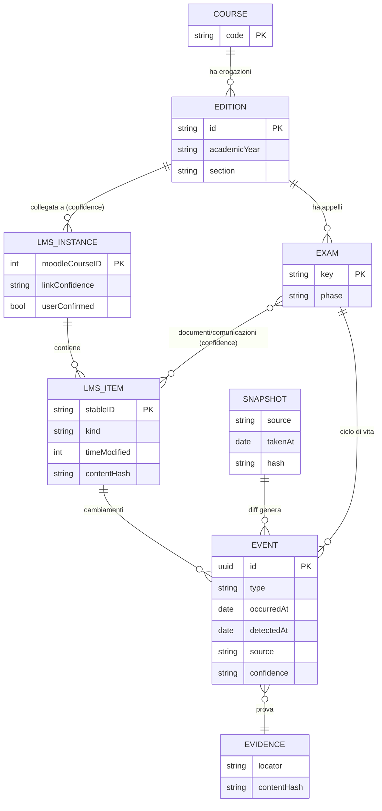
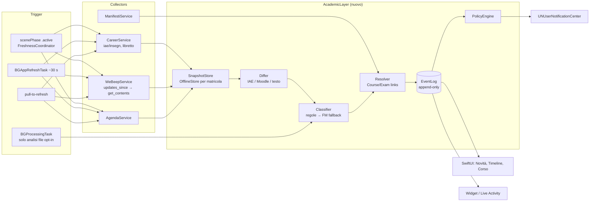
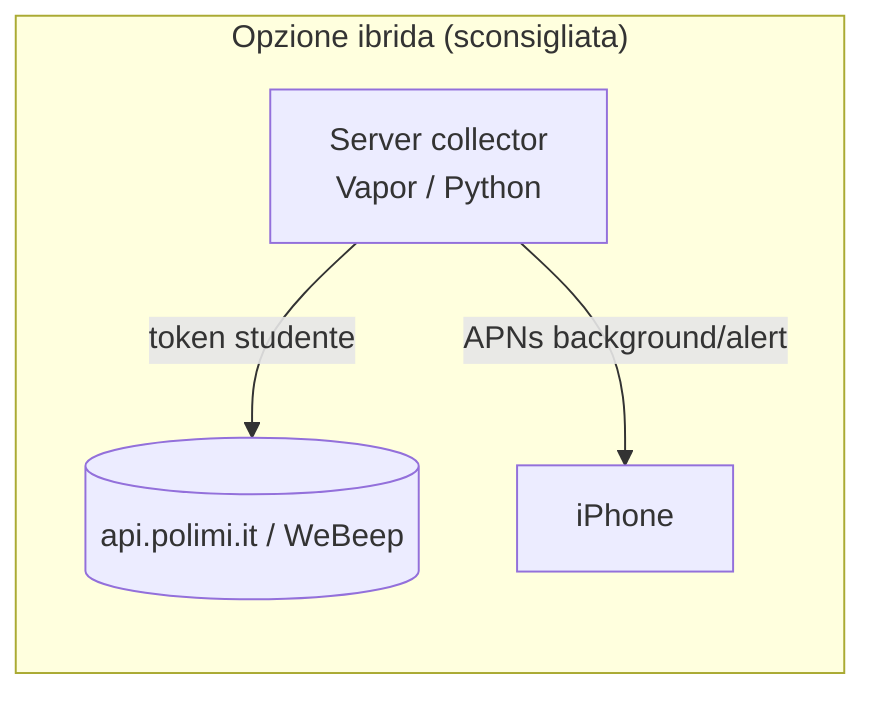

# Academic Intelligence Layer — ricerca di fattibilità e progetto

Ricerca del 2026-09-13. Si appoggia a [polimi-api-research.md](polimi-api-research.md),
[endpoint-status.md](endpoint-status.md), [polimi-auth.md](polimi-auth.md),
[webeep.md](webeep.md), [data-freshness.md](data-freshness.md),
[manifesti.md](manifesti.md), [lazy-loading.md](lazy-loading.md) e non ne ripete
il contenuto.

**Legenda.** Ogni affermazione porta una fonte: URL per il web, `path:riga` per il
repo. Etichette:

- **[VERIFICATO]** — letto nella fonte primaria (sorgente Moodle, documento
  normativo, codice del repo, probe già documentati nei doc del repo).
- **[DEDOTTO]** — conclusione ragionata da fonti verificate, non osservata.
- **[PROPOSTA]** — scelta progettuale di questo documento.
- **[NON TROVATO]** — cercato e non trovato; non va trattato come "permesso" né
  come "vietato".

---

## 0. Executive summary / verdetto

| Domanda | Risposta breve |
| --- | --- |
| **Fattibile?** | **Sì, on-device**, per la parte che conta. I dati ufficiali dell'appello arrivano già strutturati e con un id stabile (`c_appello`, date, aula, stato iscrizione, esito, `rifiutabile`, `hasCorrezioni`) da `iae/v1/insegn` (`PoliVerse/Model/Career/Career.swift:143-163`, [polimi-api-research.md §4c](polimi-api-research.md)); WeBeep espone `core_course_get_updates_since` / `core_course_check_updates` e `timemodified` per file ([sorgente Moodle 4.5](https://github.com/moodle/moodle/blob/MOODLE_405_STABLE/course/externallib.php)). Il rilevamento cambiamenti è quindi in larga parte **deterministico**. |
| **Permesso?** | **Zona grigia, nessuna autorizzazione esplicita trovata.** Il Regolamento PoliMi D.R. 6751/2025 vieta a "erogatori di servizi" di raccogliere e **memorizzare credenziali** (art. 19 c.6) e impone di non renderle accessibili a terzi (art. 21 c.2) ([PDF](https://www.normativa.polimi.it/fileadmin/user_upload/regolamenti/privacy_e_sicurezza/REGOLAMENTO_trattamento_dati_e_ICT__marzo2025.pdf)). Nessuna norma su client non ufficiali o scraping trovata [NON TROVATO]. Conseguenza pratica: **un collector server-side con credenziali/token degli studenti è da escludere**; un'app che usa la sessione dello studente sul suo dispositivo resta nel perimetro in cui PoliVerse opera già. |
| **Ne vale la pena?** | **In parte.** Alto valore / basso costo: timeline dell'appello dai dati ufficiali + notifiche di transizione di stato (iscrizioni aperte/chiudono, aula pubblicata, esito pubblicato, finestra di rifiuto) + "novità nel corso WeBeep" con etichette da regole. Basso valore / alto rischio: parsing di PDF/Excel di esiti con dati di altri studenti, entity resolution probabilistica completa, LLM, server con push. |
| **Approccio raccomandato** | Tutto sul dispositivo, sopra i servizi esistenti: snapshot → diff deterministico → **event log** locale → policy di notifica che estende `NotificationPlan` (`PoliVerse/Model/Updates/NotificationPlan.swift:52`). Identità esame = `c_appello`. Identità corso = codice insegnamento + AA, collegata a WeBeep solo con match Exact/High. Classificazione documenti a regole (nome file, sezione, regex italiane); Foundation Models solo come fallback opzionale su testo già locale e mai per decidere un'auto-associazione. Nessun server. |
| **MVP** | "Novità d'esame": (1) diff di `iae/v1/insegn` → eventi + notifiche; (2) diff WeBeep per i corsi dell'AA corrente → "nuovi materiali" con tag *Soluzioni / Esiti / Avviso esame*; (3) schermata timeline dell'appello (c'è già lo stub `PoliVerse/TestUI/ExamUI.swift`). Vedi §21. |
| **Rischi principali** | (1) nessuna garanzia di tempestività: `BGAppRefreshTask` è a discrezione del sistema ([Apple](https://developer.apple.com/documentation/backgroundtasks/bgapprefreshtask), [data-freshness.md](data-freshness.md)); (2) dati personali di terzi nei file di esiti (GDPR art. 5.1.c minimizzazione); (3) API private non documentate che cambiano senza preavviso ([endpoint-status.md "What moved"](endpoint-status.md)). |

---

## 1. Problema e flusso attuale dello studente

**Il problema.** Le informazioni su un appello arrivano da sistemi diversi, in
momenti diversi, senza identificatore comune:

| Informazione | Dove appare oggi | Fonte |
| --- | --- | --- |
| Appello esiste, date, finestra iscrizioni, aula | Servizi Online → iscrizione esami (`iae`) | `PoliVerse/Model/Career/Career.swift:154-163` (`d_app`, `ora_ok`, `d_apertura`, `d_chiusura`, `xaula`) |
| Iscritto / esito / rifiutabile | stesso servizio, `iscrizioneAttiva` | `PoliVerse/Model/Career/Career.swift:144-152` |
| Correzioni / compito corretto | `iae/v1/prove/correzioni/{c_appello}` (blob) | [polimi-api-research.md §4c](polimi-api-research.md) |
| Voto registrato nel libretto | `piano_studente/elencoinsegnamenti` | `PoliVerse/Model/Career/CareerService.swift:326-341`, `PoliVerse/Model/Career/Libretto.swift:9-26` |
| Esame nel calendario | agenda, `typeId 2` | [polimi-auth.md "Agenda"](polimi-auth.md) |
| Avvisi del docente, soluzioni, "Risultati appello del…" | WeBeep (sezioni, forum Annunci, file) | [webeep.md](webeep.md), `PoliVerse/Model/Materials/WeBeepService.swift:159-183` |
| Chi insegna il mio scaglione | Manifesto degli studi | [manifesti.md "The scaglione"](manifesti.md) |
| Email del docente / di sistema | casella @mail.polimi.it | fuori dal perimetro dell'app [DEDOTTO: nessun endpoint mail in `jaf/public/props`, `docs/endpoint-status.md:11-21`] |

**Flusso attuale [DEDOTTO dal modello dati sopra].** Lo studente controlla
periodicamente a mano Servizi Online e le pagine WeBeep di ogni corso, spesso
di più anni accademici; scopre in ritardo che è uscito un file "Esiti"; deve
ricordare da solo la scadenza di rifiuto. PoliVerse oggi:

- mostra appelli e stato (`PoliVerse/Features/Home/CourseDetailView.swift:32-36`, `:57-67`);
- programma promemoria locali per "esame domani" e "iscrizioni in chiusura" (`PoliVerse/Model/Updates/NotificationPlan.swift:113-136`);
- elenca i file WeBeep per sezione, ma **scarta tutto ciò che non è `type == "file"`** (link, label, forum) (`PoliVerse/Model/Materials/WeBeepService.swift:163-167`);
- **non ricorda lo stato precedente**, quindi non può dire "cosa è cambiato": ogni load sovrascrive (`PoliVerse/Model/Career/CareerService.swift:186-187`).

Quest'ultimo punto è il vero gap: senza uno stato precedente persistito non c'è
né change detection né notifica di evento.

---

## 2. Mappa delle fonti dati

| Fonte | Metodo di accesso | Auth | Dati utili | Freschezza / segnali di cambiamento | Stabilità | Stato legale/ToS |
| --- | --- | --- | --- | --- | --- | --- |
| **IAE** `api.polimi.it/iae` | REST JSON privato, host da `jaf/public/props` | Bearer JAF + `poliAuthProfile`/`poliAuthD_profile` ([endpoint-status.md "Required headers"](endpoint-status.md)) | insegnamenti + `appelliEsame[]`: `c_appello`, date, aula, stato iscrizione, esito, `rifiutabile`, `hasCorrezioni`; `/v1/prove/{c_appello}`; correzioni (blob) | **Nessun ETag/Last-Modified/Cache-Control** ([data-freshness.md](data-freshness.md)); solo diff di snapshot. Chiuso tra sessioni: "Utente non abilitato Code: 6" ([endpoint-status.md](endpoint-status.md)) | Media: host già migrato una volta (`www22.dmz` → `api.polimi.it`) | API privata, non documentata ([polimi-auth.md:6-7](polimi-auth.md)); nessun ToS specifico trovato [NON TROVATO] |
| **Libretto** `api.polimi.it/piano_studente` | REST JSON privato | come sopra | voti registrati, `data_esame`, `id_riga` | snapshot diff | Media | come sopra |
| **Agenda** `api.polimi.it/agenda` | REST JSON privato | come sopra | eventi `typeId 2` (esame), scadenze | snapshot; range `start_date`/`end_date` ([polimi-api-research.md §4b](polimi-api-research.md)) | Media | come sopra |
| **Notifiche PoliMi** `/v1/notifications` | REST JSON privato | come sopra | "campanella" ufficiale | shape mai catturata; array vuoto su account reale ([endpoint-status.md "Notifications"](endpoint-status.md)) | Bassa (sconosciuta) | come sopra |
| **WeBeep** (Moodle 4.x) | Web services Moodle ufficiali `webservice/rest/server.php` | `wstoken` da `tool_mobile/launch.php` ([webeep.md](webeep.md)) | corsi, sezioni, moduli, file con `timemodified`/`sortorder`/`author`, forum, compiti, calendario, update-since | `core_course_get_updates_since` / `check_updates` per modulo; `contentsinfo.lastmodified`; HTTP `no-store` ([data-freshness.md](data-freshness.md)) | **Alta** (API pubblica Moodle, versionata) | Servizio mobile abilitato dall'ateneo (probe in [webeep.md](webeep.md)); termini d'uso WeBeep specifici [NON TROVATO] |
| **Manifesto degli studi** | HTML pubblico (Struts), scraping | nessuna | codice insegnamento, docenti per scaglione, semestre, CFU, AA | pubblicazione annuale | Media (markup template) | Pubblico; scraping di pagine pubbliche [NON TROVATO: regole esplicite] |
| **Scheda insegnamento** (syllabus) | HTML pubblico | nessuna | modalità d'esame, bibliografia | annuale | Media | Pubblico |
| **Email docente** | IMAP/Graph (non implementato) | OAuth Microsoft/credenziali | comunicazioni | push lato mail server | — | **Da escludere** nell'MVP: nuove credenziali, art. 19 c.6 del Regolamento (vedi §18) |
| **File dentro WeBeep** (PDF/XLSX/CSV) | download `pluginfile.php?token=` | `wstoken` | soluzioni, esiti, avvisi | hash del contenuto, `timemodified` | Bassa (formato libero del docente) | Contengono dati personali di terzi (§10, §18) |

---

## 3. Unified Course Identity

### 3.1 Cosa dicono le fonti

| Livello | Identificatore disponibile | Fonte | Unico? |
| --- | --- | --- | --- |
| Insegnamento (catalogo) | codice numerico, es. `097785` | Manifesto `code` (`PoliVerse/Model/Study/Manifesto.swift:18`); WeBeep lo mette nel titolo `"097785 - BASI DI DATI [2025-26]"` (`PoliVerse/Model/Courses/Course.swift:101-104`) | **No** tra anni e tra lezione/laboratorio (`PoliVerse/Model/Courses/Course.swift:18-24`) |
| Insegnamento nel piano | `c_insegn_piano`, fallback `c_classe_m` | `PoliVerse/Model/Courses/Course.swift:185-199` | per matricola |
| Edizione / scaglione | modulo con `scaglioneFrom`/`scaglioneTo`, docenti `kDoc` | `PoliVerse/Model/Study/Manifesto.swift:39-52`, `:73-78` | per AA + corso di studi |
| Istanza WeBeep | `MoodleCourse.id` (numerico) + `shortname`, `fullname`, `startdate`, `enddate` | `PoliVerse/Model/Materials/Moodle.swift:19-27` | **Sì**, ma una per anno/docente |
| Classe syllabus | `c_classe` | [manifesti.md](manifesti.md) | per incarico |

Moodle espone anche `idnumber` e `categoryid` sui corsi; PoliVerse non li decodifica
ancora (`PoliVerse/Model/Materials/Moodle.swift:19-27`) [VERIFICATO assenza]. Se WeBeep li
valorizza con il codice PoliMi è **da verificare** su un account reale (Open
questions).

### 3.2 Modello proposto [PROPOSTA]

```
Course (identità logica, stabile negli anni)
  key = teachingCode                         // "097785"
  └─ Edition (un'erogazione)
       key = teachingCode + academicYear + (sectionCode | scaglione | teacherKDoc)
       └─ LMSInstance (0..n)                 // pagine WeBeep
            key = "webeep:" + moodleCourseId
```

Regole:

1. **Course** esiste solo se c'è un codice insegnamento (dal piano, da IAE o
   estratto dal titolo WeBeep con `Course.splitCode`, `PoliVerse/Model/Courses/Course.swift:135-150`).
   Un corso WeBeep senza codice diventa `Course(key: "webeep-only:<id>")` e **non
   viene fuso** con nulla automaticamente.
2. **Edition** = (codice, AA). L'AA viene da `aa_freq` (IAE, `PoliVerse/Model/Courses/Course.swift:190`),
   dal bracket del titolo WeBeep (`Course.academicYear(from:)`, `:164-171`) o da
   `startdate` con `academicYearLabel` (`:157-162`). Lo scaglione, quando noto
   dal Manifesto e dal cognome, discrimina i docenti ([manifesti.md](manifesti.md)).
3. **LMSInstance** si collega a una Edition con il resolver di §7; più istanze
   per la stessa Edition sono ammesse (lezione + esercitazioni, lab).
4. Lo studente vede **tutte** le istanze di anni passati sotto lo stesso Course
   (è ciò che già accade con `academicYears`, `PoliVerse/Model/Courses/CourseService.swift:64-66`),
   ma la "edizione corrente" è quella con `aa_freq` del piano.

---

## 4. Unified Exam Identity

### 4.1 Chiave deterministica [PROPOSTA]

```
ExamKey =
  if let c_appello           → "iae:\(c_appello)"                 // Exact, ufficiale
  else                       → "cmp:\(teachingCode)|\(yyyy-MM-dd Rome)|\(slot)"
  slot = ora_ok normalizzata "HH:mm" se presente, altrimenti "day"
```

- `c_appello` è l'id del servizio iscrizioni, usato anche nei path
  `/v1/prove/{c_appello}` e `/v1/prove/correzioni/{c_appello}`
  ([polimi-api-research.md §4c](polimi-api-research.md)); PoliVerse lo usa già
  come `ExamSession.id` (`PoliVerse/Model/Career/Career.swift:199`) e come chiave di
  dedup delle notifiche (`PoliVerse/Model/Updates/NotificationPlan.swift:117`). [VERIFICATO]
- La chiave composita serve solo per esami **visti prima nel calendario o in
  WeBeep** ("Appello del 31 agosto") e non ancora nel portale. Quando arriva il
  record IAE con stesso codice + data, l'entità composita viene **promossa**
  (alias `cmp:… → iae:…`), non duplicata. Le date usano sempre il calendario di
  Roma (`PoliMiDate`, [polimi-auth.md "The timestamp trap"](polimi-auth.md)).
- **Mai** usare la data come unica chiave: due appelli nello stesso giorno
  (scritto/orale, parti A/B) esistono [DEDOTTO: `descTipoAppello` distingue il
  tipo, `PoliVerse/Model/Career/Career.swift:160`].

### 4.2 Attributi dell'esame e loro fonte autorevole

| Attributo | Fonte autorevole | Fonte secondaria (solo "evidenza") |
| --- | --- | --- |
| data/ora | IAE `d_app` + `ora_ok` | agenda `typeId 2`; testo WeBeep |
| finestra iscrizioni | IAE `d_apertura`/`d_chiusura`, `iscrizioniAperte` | — |
| stato iscrizione | IAE `iscrizioneAttiva` | — |
| aula | IAE `xaula` | agenda `room`; avviso WeBeep ("aule assegnate per cognome") |
| istruzioni / comunicazioni | — | WeBeep forum/label/file; `/v1/notifications` |
| soluzioni | IAE `hasCorrezioni` + `/prove/correzioni` (correzioni personali) | file WeBeep classificati "Soluzioni" |
| risultati | IAE `hasEsito`, `xverbEsito`, `verb_positivo` | file WeBeep "Esiti" (solo segnale, §10) |
| finestra di rifiuto | IAE `rifiutabile` (booleano) | testo WeBeep ("entro il…") |
| verbalizzazione | libretto (`sostenuti`, `data_esame`) | — |

Principio: **una fonte secondaria non sovrascrive mai un valore della fonte
autorevole**; lo affianca con `confidence` e `evidence` (§17). La data di
scadenza del rifiuto non risulta esposta come campo [NON TROVATO nei campi
citati dal bundle]: finché non si osserva, si mostra "rifiutabile: sì" e la
scadenza solo se estratta da un testo, marcata come *Probabile*.

---

## 5. Modello dati

### 5.1 Scelta dello storage

| Opzione | Pro | Contro | Fonte |
| --- | --- | --- | --- |
| `OfflineStore` JSON per matricola (attuale) | già condiviso con i widget via app group, per-account, testato | nessuna query, nessuna storia; riscrittura intera del file | `Shared/OfflineStore.swift:18-132` |
| **SwiftData** | `@Query`, relazioni, **history API** (`fetchHistory`, `deleteHistory`, iOS 18+) | migrazione; [data-freshness.md](data-freshness.md) lo sconsigliava *per il solo problema del trigger* | SDK iOS 27, `SwiftData.swiftinterface` (`fetchHistory` `@available(iOS 18)`); [SwiftData](https://developer.apple.com/documentation/swiftdata) |
| Core Data + Persistent History Tracking | maturo | più boilerplate, non usato nel repo | [Apple](https://developer.apple.com/documentation/coredata/persistent-history-tracking) |

**Raccomandazione [PROPOSTA].** Per l'MVP **event log append-only in JSON** dentro
`OfflineStore` (un file `events` per matricola, compattato a N giorni) + gli
snapshot già esistenti. Il deployment target è iOS 26 (`PoliVerse.xcodeproj`:
`IPHONEOS_DEPLOYMENT_TARGET = 26.0`, `SWIFT_VERSION = 6.0`), quindi SwiftData con
history è disponibile; conviene passarci **quando** servono query sul grafo
Course↔Exam↔Document (fase 3). La history di SwiftData registra *transazioni del
database*, non eventi di dominio con provenienza: non sostituisce l'event log,
lo affianca. [DEDOTTO dalla firma `HistoryDescriptor<DefaultHistoryTransaction>`
nell'SDK]

### 5.2 Tipi Swift (stile SwiftData, `nonisolated` e `Sendable` come nel repo)

```swift
// MARK: identità
nonisolated struct CourseKey: Hashable, Codable, Sendable { let teachingCode: String }
nonisolated struct EditionKey: Hashable, Codable, Sendable {
    let course: CourseKey; let academicYear: String   // "2025/26"
    let section: String?                              // scaglione / sezione / kDoc
}
nonisolated enum ExamKey: Hashable, Codable, Sendable {
    case official(cAppello: Int)
    case composite(course: CourseKey, day: String, slot: String) // "2026-08-31", "09:30" | "day"
}

// MARK: valori con provenienza (§17)
nonisolated struct Sourced<Value: Codable & Sendable & Equatable>: Codable, Sendable, Equatable {
    var value: Value
    var source: DataSource            // .iae, .libretto, .agenda, .webeep, .manifesto, .user
    var detectedAt: Date
    var lastConfirmedAt: Date
    var confidence: MatchConfidence   // .exact, .high, .probable, .ambiguous, .unmatched
    var evidence: EvidenceRef?
}

nonisolated struct EvidenceRef: Codable, Sendable, Equatable {
    var kind: Kind                     // .apiField, .moodleModule, .file, .forumPost, .textSpan
    var locator: String                // "iae:insegn/097785/appelliEsame[c_appello=123].xaula"
    var contentHash: String?           // SHA-256 esadecimale (CryptoKit)
    enum Kind: String, Codable, Sendable { case apiField, moodleModule, file, forumPost, textSpan }
}

// MARK: entità
@Model final class CourseEntity {
    @Attribute(.unique) var code: String
    var displayName: Sourced<String>
    @Relationship(deleteRule: .cascade) var editions: [EditionEntity]
}

@Model final class EditionEntity {
    @Attribute(.unique) var id: String          // EditionKey serializzata
    var academicYear: String
    var teachers: [Sourced<String>]
    var validFrom: Date?; var validTo: Date?    // tempo valido (§16)
    @Relationship var lmsInstances: [LMSInstanceEntity]
    @Relationship var exams: [ExamEntity]
}

@Model final class LMSInstanceEntity {
    @Attribute(.unique) var moodleCourseID: Int
    var fullname: String; var shortname: String?; var idnumber: String?
    var startDate: Date?; var endDate: Date?
    var linkConfidence: MatchConfidence
    var linkEvidence: [EvidenceRef]
    var userConfirmed: Bool                     // l'utente ha confermato un Probable
    @Relationship(deleteRule: .cascade) var items: [LMSItemEntity]
}

@Model final class LMSItemEntity {                // file, cartella, link, forum post, compito, label
    @Attribute(.unique) var stableID: String     // "cm:<cmid>" | "cm:<cmid>/f:<filepath><filename>" | "post:<id>"
    var kind: String                             // modname / "file" / "post"
    var sectionID: Int; var sectionName: String; var sortOrder: Int
    var name: String; var author: String?
    var timeModified: Date?; var fileSize: Int?; var mimeType: String?
    var metadataHash: String; var contentHash: String?
    var tags: [DocumentTag]                      // §9
    var firstSeenAt: Date; var lastSeenAt: Date; var removedAt: Date?
}

@Model final class ExamEntity {
    @Attribute(.unique) var key: String          // ExamKey serializzata
    var aliases: [String]                         // composite → official
    var date: Sourced<Date>?
    var room: Sourced<String>?
    var registrationOpens: Sourced<Date>?; var registrationCloses: Sourced<Date>?
    var registration: Sourced<RegistrationState>?
    var result: Sourced<ResultState>?            // solo del proprio studente
    var refusable: Sourced<Bool>?
    var phase: ExamPhase                          // derivata dagli eventi (§6)
    @Relationship var documents: [LMSItemEntity]
}

nonisolated enum ExamPhase: String, Codable, Sendable {
    case discovered, registrationOpen, registered, registrationClosed,
         roomPublished, held, solutionsPublished, resultsDetected,
         gradePublished, refusalWindow, gradeRegistered, withdrawn
}
```

### 5.3 Diagramma ER



---

## 6. Modello a eventi

Ispirato all'**event sourcing** (lo stato è la piega di una sequenza di eventi
immutabili; [Fowler, *Event Sourcing*](https://martinfowler.com/eaaDev/EventSourcing.html)),
ma **non** puro: la verità resta nelle API ufficiali, gli eventi sono il
*registro di ciò che l'app ha osservato* e servono a notifiche, timeline e audit.
[PROPOSTA]

```swift
nonisolated struct AcademicEvent: Codable, Sendable, Identifiable {
    let id: UUID
    let type: EventType
    let entity: EntityRef                 // .exam(ExamKey) | .course(CourseKey) | .item(String)
    let occurredAt: Date?                 // quando è successo nel mondo, se noto
    let detectedAt: Date                  // quando l'app l'ha visto
    let source: DataSource
    let confidence: MatchConfidence
    let evidence: EvidenceRef
    let oldValue: JSONValue?              // JSONValue esiste già: PoliVerse/Model/Support/JSONValue.swift
    let newValue: JSONValue?
    var relevance: Relevance              // calcolata dalla policy (§11), non dal detector
    /// Stabile: stesso cambiamento osservato due volte → stesso id logico.
    var dedupKey: String { "\(type.rawValue)|\(entity)|\(newValue.map(String.init(describing:)) ?? "-")" }
}

nonisolated enum EventType: String, Codable, Sendable {
    case examDiscovered, registrationOpened, registrationClosingSoon, registered, unregistered,
         registrationClosed, roomPublished, roomChanged, dateChanged, examWithdrawn,
         teacherCommunication, examHeld, solutionPublished, correctionsAvailable,
         resultsFileDetected, gradePublished, refusalWindowOpened, gradeRefused, gradeRegistered,
         materialAdded, materialModified, materialRemoved, assignmentAdded, deadlineChanged
}
```

### Ciclo di vita e sorgente di ciascun evento

| Evento | Regola deterministica di rilevamento | Fonte | Confidence |
| --- | --- | --- | --- |
| `examDiscovered` | `c_appello` nuovo nello snapshot IAE | `iae/v1/insegn` | Exact |
| `registrationOpened` | `iscrizioniAperte` false→true, oppure `now ≥ d_apertura` | IAE | Exact |
| `registrationClosingSoon` | evento *temporale* (non un diff): `d_chiusura − now ≤ 24h` e non iscritto | IAE | Exact |
| `registered` / `unregistered` | `iscrizioneAttiva` nil↔non-nil | IAE | Exact |
| `roomPublished` / `roomChanged` | `xaula` vuoto→valore / valore→altro | IAE | Exact |
| `dateChanged` | `d_app`/`ora_ok` diversi per stesso `c_appello` | IAE | Exact |
| `examWithdrawn` | `c_appello` sparisce **prima** della data (dopo la data è normale, `PoliVerse/Model/Career/CareerService.swift:96-98`) | IAE | High (può essere solo servizio chiuso: Code 6) |
| `teacherCommunication` | nuovo post in forum "Annunci"/news o label modificata nel corso collegato | WeBeep | Exact sull'item, tier del link sull'esame |
| `examHeld` | temporale: `now > date + 3h` | derivato | Exact |
| `solutionPublished` | item WeBeep taggato `solutions` collegato all'esame | WeBeep | tier del match (§7) |
| `correctionsAvailable` | `iscrizioneAttiva.hasCorrezioni` false→true | IAE | Exact |
| `resultsFileDetected` | item taggato `results` (§10) | WeBeep | ≤ High, mai Exact |
| `gradePublished` | `hasEsito` false→true | IAE | Exact |
| `refusalWindowOpened` | `rifiutabile` false→true | IAE | Exact |
| `gradeRegistered` | riga con `c_insegn`/nome passa da `daSostenere` a `sostenuti` | libretto | High (join per nome/codice) |

La fase dell'esame (`ExamPhase`) è una funzione pura `fold(events) -> ExamPhase`,
testabile come `NotificationPlan` (`PoliVerse/Model/Updates/NotificationPlan.swift:48-52`).

---

## 7. Entity resolution

Riferimenti: modello di **Fellegi–Sunter** (1969), confronto di coppie con pesi
di accordo/disaccordo e due soglie che separano *match*, *possibile match*
(revisione manuale) e *non match* ([JASA 64(328)](https://doi.org/10.1080/01621459.1969.10501049));
**blocking** per non confrontare tutte le coppie; pratica standard
*deterministic-first*: regole esatte prima, punteggio poi. Qui il dominio è
piccolo (≤ ~50 corsi WeBeep per studente), quindi il blocking serve più alla
correttezza (non confrontare anni diversi) che alle prestazioni. [DEDOTTO]

### 7.1 Segnali

| Segnale | Normalizzazione | Peso indicativo [PROPOSTA] |
| --- | --- | --- |
| codice insegnamento | solo cifre, zero-pad a 6 | decisivo (+8) |
| `c_appello` citato in testo/URL | intero | decisivo (+10) |
| anno accademico | "2025/26" ⇐ "[2025-26]", `startdate` | blocking (≠ ⇒ scarta) |
| cognome docente | maiuscolo, senza accenti (come lo scaglione, [manifesti.md](manifesti.md)) | +3 |
| nome corso | `Course.normalise` + stopword + token set Jaccard | +0…+4 |
| data esame nel testo/filename | parser date italiane (§9) | +4 se = data IAE, −6 se ≠ |
| semestre / numero appello | "I appello", "2° appello" | +1 |
| sezione WeBeep | "Esami", "Appelli", "Esiti" | +1 (solo classificazione) |
| matricola nel file | solo **presenza della propria** (§10) | +2 per il *proprio* esame |

### 7.2 Tier di confidence

| Tier | Condizione | Azione |
| --- | --- | --- |
| **Exact** | id ufficiale condiviso (`c_appello`, `moodleID` già noto, `Course.moodleID` diretto `PoliVerse/Model/Materials/WeBeepService.swift:227`) | collega automaticamente |
| **High** | codice insegnamento + AA uguali, **unico candidato** | collega automaticamente, mostra "collegato automaticamente" |
| **Probable** | punteggio ≥ soglia alta ma senza codice, oppure codice con ≥2 candidati nello stesso AA | **non** collega; suggerisce con "È questo il corso?" |
| **Ambiguous** | ≥2 candidati con punteggi entro Δ | non collega; chiede solo se l'utente apre il corso |
| **Unmatched** | sotto soglia bassa | resta orfano, visibile in "Altri corsi WeBeep" |

### 7.3 Pseudo-codice

```swift
func resolve(lms: LMSInstanceSnapshot, editions: [Edition]) -> Resolution {
    // 0. Link già confermato dall'utente o già Exact: stabile, non ricalcolare.
    if let pinned = links[lms.moodleID], pinned.userConfirmed || pinned.tier == .exact { return pinned }

    // 1. Blocking per anno accademico (con tolleranza: corsi annuali a cavallo).
    let ay = lms.academicYear            // bracket del titolo ?? startdate
    let block = editions.filter { ay == nil || $0.academicYear == ay }

    // 2. Regole deterministiche.
    if let code = lms.teachingCode {      // Course.splitCode / shortname / idnumber
        let hits = block.filter { $0.course.code == code }
        switch hits.count {
        case 1:  return .init(hits[0], tier: .high, evidence: [.code(code), .ay(ay)])
        case 0:  break                    // codice non nel piano: può essere corso a scelta/uditore
        default: return disambiguate(hits, lms)   // lezione vs lab, due sezioni
        }
    }

    // 3. Punteggio (Fellegi–Sunter semplificato).
    let scored = block.map { e in (e, score(lms, e)) }.sorted { $0.1 > $1.1 }
    guard let best = scored.first, best.1 >= T_low else { return .unmatched }
    if scored.count > 1, best.1 - scored[1].1 < DELTA { return .ambiguous(scored.prefix(3)) }
    return best.1 >= T_high ? .probable(best.0) : .unmatched   // mai auto-link senza codice
}
```

Stesso schema per **documento → esame**: blocking = Edition già collegata;
regola deterministica = data nel filename/testo uguale a `d_app` di un unico
appello di quell'Edition.

### 7.4 Tre esempi svolti

**Esempio A — High.**
WeBeep `fullname = "097785 - BASI DI DATI [2025-26]"`, `startdate` = 2025-09-22.
Piano: `c_insegn_piano = 097785`, `aa_freq = 2025/26`, unica Edition.
→ codice ✔ AA ✔ candidati = 1 → **High**, auto-link. (Formato del titolo come in
`PoliVerse/Model/Courses/Course.swift:101-104`.)

**Esempio B — Ambiguous → disambiguato a High.**
Due istanze WeBeep: `"054321 - FISICA [2025-26] - Sez. A-L"` e
`"054321 - FISICA [2025-26] - Sez. M-Z"`. Studente "Rossi", Manifesto: modulo
con scaglione `MAA`–`ZZZ` (da, compreso / a, escluso) docente *Bianchi*.
Regola deterministica secondaria: il cognome cade nello scaglione M–Z
(`ManifestoModule` `PoliVerse/Model/Study/Manifesto.swift:48-62`) **e** il nome del
docente del Manifesto compare nel `fullname`/partecipanti → un solo candidato →
**High**. Se il suffisso della sezione non è interpretabile → resta
**Ambiguous** e si chiede all'utente. [Nomi e formato del suffisso sono
ipotetici: il formato reale delle sezioni su WeBeep va verificato.]

**Esempio C — Probable (non auto-collegato).**
File in WeBeep corso "Analisi Matematica 1 [2025-26]" (High col piano):
`Risultati_appello_luglio.pdf`. IAE per quell'Edition: appelli il 2026-07-02 e
2026-07-16. Filename: mese "luglio" ma nessun giorno → 2 candidati → punteggio
pari → **Ambiguous** a livello di esame; il file resta collegato **al corso** con
tag `results`, non all'esame. Se il PDF (testo locale) contiene "Appello del
16/07/2026" → data = unico appello → **High**. Se contiene solo "16 luglio" senza
anno ma AA coerente → **Probable**: mostrato come "Probabilmente l'appello del
16 luglio", nessuna notifica ad alta priorità.

---

## 8. Change detection

### 8.1 Cosa offre ciascuna fonte

| Fonte | Segnale nativo | Uso |
| --- | --- | --- |
| IAE / libretto / agenda | nessuno (niente ETag/Last-Modified, [data-freshness.md](data-freshness.md)) | **diff strutturale di snapshot** normalizzati |
| WeBeep | `core_course_get_updates_since(courseid, since, filter[])` e `core_course_check_updates(courseid, tocheck[{contextlevel:"module", id, since}], filter[])`; aree: `configuration, fileareas, completion, ratings, comments, gradeitems, outcomes` | **prefiltro economico**: quali moduli sono cambiati | [`course/externallib.php` 4.5, ~3442-3626](https://github.com/moodle/moodle/blob/MOODLE_405_STABLE/course/externallib.php) |
| WeBeep | `core_course_get_contents(courseid, options[])`, con opzioni `excludecontents`, `sectionid`, `cmid`, `modname` | **diff di dettaglio** solo dove il prefiltro dice "updated" | stesso file, ~52-76 |
| WeBeep file | `timecreated`, `timemodified`, `filesize`, `sortorder`, `author`, `filepath`; `contentsinfo.lastmodified` per modulo | fingerprint dei metadati | stesso file, ~505-545 e ~339-360 |

Dettaglio importante dal sorgente: `course_check_module_updates_since` segna
`configuration.updated` quando `mod.timemodified > from`, e per i file cerca
nell'area con `timemodified > from` ([`course/lib.php` ~4276-4320](https://github.com/moodle/moodle/blob/MOODLE_405_STABLE/course/lib.php)). Quindi:
**rileva aggiunte e modifiche, non le rimozioni** (un file cancellato non ha
`timemodified` nuovo) [DEDOTTO dal codice] → le rimozioni si trovano solo con il
diff completo di `get_contents`, da fare più di rado.

Che queste funzioni siano **abilitate nel servizio `moodle_mobile_app` di
WeBeep** è molto probabile (l'app mobile ufficiale le usa) ma **non verificato**:
[webeep.md](webeep.md) elenca solo le funzioni usate da myPoliFile.

### 8.2 Pseudo-codice

```swift
/// Una passata per corso. Budget: BGAppRefreshTask ≈ 30 s (data-freshness.md).
func detectChanges(course: LMSInstance, now: Date) async throws -> [AcademicEvent] {
    let since = course.lastCheckedAt ?? .distantPast
    // 1. Prefiltro (1 richiesta).
    let updates = try await api.call("core_course_get_updates_since",
        parameters: ["courseid": "\(course.id)", "since": "\(Int(since.timeIntervalSince1970) - 60)"],  // 60 s di margine clock skew
        as: MoodleUpdates.self)
    let changedCMs = Set(updates.instances.filter { !$0.updates.isEmpty }.map(\.id))
    let fullSweepDue = now.timeIntervalSince(course.lastFullSweepAt ?? .distantPast) > 24*3600
    guard !changedCMs.isEmpty || fullSweepDue else { course.lastCheckedAt = now; return [] }

    // 2. Dettaglio (1 richiesta; per molti corsi usare cmid se changedCMs è piccolo).
    let sections = try await api.contents(courseID: course.id)
    let current = flatten(sections)          // [stableID: ItemFingerprint], TUTTI i modname
    let previous = store.items(for: course.id)

    var events: [AcademicEvent] = []
    for (id, fp) in current {
        switch previous[id] {
        case nil:                                  events.append(.materialAdded(id, fp))
        case let old? where old.metadataHash != fp.metadataHash:
            events.append(.materialModified(id, old: old, new: fp, diff: metadataDiff(old, fp)))
        default: break
        }
    }
    if fullSweepDue {
        for id in previous.keys where current[id] == nil { events.append(.materialRemoved(id)) }
        course.lastFullSweepAt = now
    }
    store.replaceItems(current, for: course.id)
    course.lastCheckedAt = now
    return events.flatMap(semanticDiff)            // §8.3: material → solution/results/room/...
}

/// Fingerprint dei metadati: niente download.
func fingerprint(_ c: MoodleContent, module: MoodleModule, section: MoodleSection) -> ItemFingerprint {
    let meta = [c.filepath ?? "/", c.filename ?? "", "\(c.filesize ?? 0)", "\(c.timemodified ?? 0)",
                module.name, section.name, "\(module.visible ?? 1)"].joined(separator: "\u{1F}")
    return .init(metadataHash: SHA256.hash(data: Data(meta.utf8)).hex)   // CryptoKit, già importato in WeBeepAuth.swift:2
}

/// IAE: diff strutturale su valori normalizzati (date in Europe/Rome, stringhe trimmate).
func diffIAE(old: [Int: ExamDTO], new: [Int: ExamDTO]) -> [AcademicEvent] {
    var out: [AcademicEvent] = []
    for (id, n) in new {
        guard let o = old[id] else { out.append(.examDiscovered(id)); continue }
        if o.iscrizioniAperte != true, n.iscrizioniAperte == true { out.append(.registrationOpened(id)) }
        if (o.xaula ?? "").isEmpty, let r = n.xaula, !r.isEmpty { out.append(.roomPublished(id, r)) }
        else if let a = o.xaula, let b = n.xaula, !a.isEmpty, a != b { out.append(.roomChanged(id, a, b)) }
        if o.d_app != n.d_app || o.ora_ok != n.ora_ok { out.append(.dateChanged(id)) }
        let os = o.iscrizioneAttiva, ns = n.iscrizioneAttiva
        if (os == nil) != (ns == nil) { out.append(ns == nil ? .unregistered(id) : .registered(id)) }
        if os?.hasEsito != true, ns?.hasEsito == true { out.append(.gradePublished(id)) }
        if os?.rifiutabile != true, ns?.rifiutabile == true { out.append(.refusalWindowOpened(id)) }
    }
    // Scomparsa: evento solo se la risposta è "sana" (non Code 6, non vuota per errore).
    return out
}
```

Guard-rail indispensabili [PROPOSTA]:

- **Mai diffare contro una risposta degradata.** Un `insegn` vuoto per Code 6
  (`PoliVerse/Model/Career/CareerService.swift:318`, `:372`) o per errore non deve
  generare "esame ritirato" per tutti gli appelli: si diffa solo tra due
  snapshot *riusciti*, e le scomparse richiedono conferma in due passate.
- **Primo avvio = baseline silenziosa**: tutti gli item esistenti diventano
  `firstSeenAt` senza eventi notificabili (altrimenti 400 notifiche "nuovo file").
- **Idempotenza**: `dedupKey` (§6) impedisce doppioni quando lo stesso cambio è
  visto da foreground e background.

### 8.3 Text diff e semantic diff

- **Text diff** solo su testi piccoli già scaricati dalle API (label, summary di
  sezione, post di forum): diff a righe (Myers) sul testo HTML→plain già
  prodotto da `HTMLText` (`PoliVerse/Model/Support/HTMLText.swift`). I PDF **non** si
  diffano a testo nell'MVP: si confronta `contentHash`/`timemodified`.
- **Semantic diff** = regole che mappano un cambio grezzo in un evento di
  dominio:

| Cambio grezzo | + condizione | → Evento semantico |
| --- | --- | --- |
| `materialAdded` | tag `solutions` | `solutionPublished` |
| `materialAdded` | tag `results` | `resultsFileDetected` |
| `materialAdded`/post | tag `examNotice` + data = appello noto | `teacherCommunication(exam)` |
| label/summary modificata | regex data cambiata ("posticipato", "spostato al") | `deadlineChanged` / `dateChanged` con confidence Probable |
| modulo `assign` nuovo | — | `assignmentAdded` (`duedate` da `mod_assign_get_assignments`) |
| IAE `xaula` cambiata | — | `roomChanged` (Exact) |

> Nota: `MoodleContent` nel repo decodifica oggi solo `type, filename, filesize,
> fileurl, timemodified, mimetype` e `MoodleModule` non ha `visible`/`url`/`dates`
> (`PoliVerse/Model/Materials/Moodle.swift:51-66`). Il fingerprint sopra richiede di
> aggiungere `filepath`, `timecreated`, `sortorder`, `author`, `visible`,
> `contentsinfo` (tutti presenti nella risposta Moodle, vedi §8.1).

---

## 9. Classificazione dei documenti

Principio: **regole prima**, ML/LLM solo sul residuo, e il risultato del
fallback non può mai produrre un auto-link né una notifica ad alta priorità.
[PROPOSTA]

### 9.1 Tag

`solutions`, `results`, `examNotice` (avviso d'esame/aule/istruzioni),
`examText` (testo del compito senza soluzioni), `lectureMaterial`, `exercise`,
`assignment`, `admin` (programma, regole d'esame), `recording`, `other`.

### 9.2 Regole (in ordine; la prima che scatta vince, ma si accumulano le evidenze)

Normalizzazione: minuscolo, `_`/`-`/`.` → spazio, accenti rimossi.

| # | Campo | Pattern (regex ICU, case-insensitive) | Tag | Peso |
| --- | --- | --- | --- | --- |
| R1 | nome file / nome modulo | `\b(esiti?|risultati|valutazioni|voti|graduatoria|ammessi( all'?orale)?|results|grades|marks)\b` | `results` | forte |
| R2 | nome file / modulo | `\b(soluzion[ei]|svolt[oaie]|correzion[ei]|solutions?|solved|risolt[oi])\b` | `solutions` | forte |
| R3 | nome file | `\b(testo|tema|traccia|compito)\b` e **non** R2 | `examText` | medio |
| R4 | nome/sezione | `\b(aule?|suddivisione|ripartizione|convocazion[ei]|orari[oa]? (dell')?esame|istruzioni|avviso)\b` | `examNotice` | medio |
| R5 | sezione | `\b(esami|appelli|prove (in itinere|scritte)|exams?)\b` | booster per R1–R4 | debole |
| R6 | nome | `\b(esercitazion[ei]|eserciz[io]|exercises?|tutorato|lab(oratorio)?)\b` | `exercise` | medio |
| R7 | nome | `\b(lezione|lecture|slides?|lucidi|dispense|capitolo|cap\.)\s*\d*` | `lectureMaterial` | medio |
| R8 | `modname` | `assign` | `assignment` | forte |
| R9 | `mimetype` | `video/*` o link a registrazioni | `recording` | forte |
| R10 | nome | `\b(programma|syllabus|regole d'esame|modalit[aà] d'esame|calendario)\b` | `admin` | medio |

**Date nel testo/filename** (per il link all'esame, §7):

```
(?<d>[0-3]?\d)[\/\.\-_ ](?<m>[01]?\d)[\/\.\-_ ](?<y>(20)?\d{2})          // 31/08/2026, 31-08-26, 31_08_2026
(?<y>20\d{2})[\-_]?(?<m>[01]\d)[\-_]?(?<d>[0-3]\d)                       // 20260831, 2026-08-31
(?<d>[0-3]?\d)\s+(?<mese>gennaio|febbraio|marzo|aprile|maggio|giugno|luglio|agosto|settembre|ottobre|novembre|dicembre)(\s+(?<y>20\d{2}))?
\b(?<n>[IVX]+|\d)\s*°?\s*appello\b                                        // "II appello", "2° appello"
```

Anni a due cifre e mesi senza anno si risolvono con l'AA dell'Edition
(settembre→agosto); un file di "luglio" in un corso `2025/26` è luglio 2026.
Date ambigue gg/mm vs mm/gg: in Italia si assume gg/mm; `12/07` resta
*Probable* se esistono appelli sia il 12 luglio sia il 7 dicembre.

**Conflitti noti.** "Soluzioni e risultati" nello stesso nome → entrambi i tag,
e §10 decide sul contenuto. "Esercitazione 3 soluzioni" → `exercise`+`solutions`
ma **non** collegato a un esame (nessuna data d'appello).

### 9.3 Fallback (solo se nessuna regola forte)

| Livello | Tecnologia | Disponibilità | Uso |
| --- | --- | --- | --- |
| 1 | Classificatore testo **Create ML** → `NLModel` (NaturalLanguage) | NaturalLanguage iOS 12+ ([NLModel](https://developer.apple.com/documentation/naturallanguage/nlmodel)) | solo con un dataset etichettato di nomi file reali (che oggi non c'è) |
| 2 | **Foundation Models** con `@Generable` e `SystemLanguageModel(useCase: .contentTagging)` | iOS 26+, `SystemLanguageModel` con `availability` che può essere `.deviceNotEligible` / `.appleIntelligenceNotEnabled`; `supportedLanguages` e `contextSize` esposti a runtime (SDK `FoundationModels.swiftinterface`; [docs](https://developer.apple.com/documentation/foundationmodels/systemlanguagemodel)) | etichettare nome file + titolo sezione + prime righe di testo locale, output vincolato a enum |

```swift
import FoundationModels

@Generable
enum DocKind: String { case solutions, results, examNotice, examText, lectureMaterial, exercise, admin, other }

@Generable
struct DocGuess {
    @Guide(description: "Categoria del documento universitario")
    let kind: DocKind
    @Guide(description: "Data dell'appello citata, formato yyyy-MM-dd, se presente")
    let examDate: String?
}

func fallbackClassify(name: String, section: String, snippet: String) async -> DocGuess? {
    let model = SystemLanguageModel(useCase: .contentTagging)
    guard case .available = model.availability else { return nil }   // nessun fallback: resta `other`
    let session = LanguageModelSession(model: model,
        instructions: "Classifica materiali di corsi del Politecnico di Milano. Non inventare date.")
    let prompt = "File: \(name)\nSezione: \(section)\nTesto: \(snippet.prefix(1500))"
    return try? await session.respond(to: prompt, generating: DocGuess.self).content
}
```

Vincoli: l'esito LLM porta al massimo confidence **Probable**; il `snippet` non
deve contenere righe di esiti con dati di altri (§10: il testo passa prima dal
filtro). L'art. 39 del Regolamento PoliMi vieta di fornire dati personali non
anonimizzati a "sistemi di IA ospitati al di fuori dell'Ateneo"
([PDF, art. 39](https://www.normativa.polimi.it/fileadmin/user_upload/regolamenti/privacy_e_sicurezza/REGOLAMENTO_trattamento_dati_e_ICT__marzo2025.pdf)):
il regolamento si rivolge agli utenti dei servizi di Ateneo, e un modello
on-device non è "ospitato fuori" in senso cloud [DEDOTTO]; un LLM cloud è invece
**escluso**.

---

## 10. Rilevamento dei risultati d'esame

### 10.1 Prima la fonte ufficiale

L'esito del **proprio** esame è già esposto in forma strutturata:
`iscrizioneAttiva.hasEsito`, `xverbEsito`, `verb_esito_number`, `verb_positivo`,
`rifiutabile` (`PoliVerse/Model/Career/Career.swift:144-152`, `:169-181`). Quindi il
file "Esiti" su WeBeep **non serve per conoscere il voto**: serve solo come
**segnale anticipato** ("il docente ha pubblicato qualcosa") nei casi in cui il
file precede la pubblicazione sul portale. [DEDOTTO]

### 10.2 Pipeline

```
item WeBeep taggato results (R1)  ─┬─ solo metadati → evento resultsFileDetected (confidence ≤ High)
                                   │
         [opt-in esplicito] ───────┴─ scarica in memoria/tmp → estrai testo → classifica
                                        PDF testuale: PDFKit PDFDocument.string (iOS 11+)
                                        PDF scansione: Vision RecognizeDocumentsRequest (iOS 26, .tables)
                                                       o RecognizeTextRequest (iOS 18)
                                        XLSX: CoreXLSX (Apache-2.0, dipendenza esterna)
                                        CSV: parser locale
                                     → cerca SOLO la propria matricola / codice persona
                                     → estrai la riga dello studente → scarta tutto il resto
```

Fonti: `PDFDocument.string` (`PDFKit.framework/Headers/PDFDocument.h`, SDK iOS
27), `RecognizeDocumentsRequest` `@available(iOS 26)` con
`DocumentObservation.Container.tables` e `RecognizeTextRequest`
`@available(iOS 18)` (`Vision.swiftinterface`, SDK iOS 27);
[CoreXLSX](https://github.com/CoreOffice/CoreXLSX) (licenza Apache-2.0, ultimo
push 2024-03-25 secondo l'API GitHub). Il README del repo dichiara "No
third-party dependencies" (`README.md:54`): XLSX è quindi fase ≥3 o si evita.

### 10.3 Risultati vs soluzioni — euristiche anti falso positivo

| Segnale | Indica `results` | Indica `solutions` |
| --- | --- | --- |
| tabella con ≥ 5 righe di codici a 6 cifre (matricole) o "codice persona" a 8 cifre | forte | — |
| colonne `voto`, `esito`, `valutazione`, `punteggio`, `ammesso`, `insufficiente`, `ritirato`, `assente` | forte | — |
| numeri 0–30 / "30L" / "30 e lode" allineati a identificativi | forte | — |
| "Esercizio 1", "Domanda", formule, "si ottiene", "quindi" | — | forte |
| filename R2 ma contenuto con tabella matricole | **results vince** | — |
| filename R1 ma nessuna tabella / nessuna matricola | declassa a `examNotice` (es. "Risultati: orale il…") | — |

### 10.4 Privacy (vincolo di progetto, non opzionale)

- **Mai persistere righe di altri studenti.** Il file intero resta solo dove
  già sta oggi se lo studente lo scarica (`FileDownloadService`,
  `PoliVerse/Model/Materials/FileDownloadService.swift:41-52`); l'indice estratto
  conserva **solo**: `{examKey, contentHash, found: Bool, ownGrade?}`.
- Il testo estratto vive in memoria e viene rilasciato a fine analisi; niente
  log di valori (come già fa `NoticeService`: "keys and types, never values",
  [endpoint-status.md](endpoint-status.md)).
- Nessun conteggio o statistica sugli altri ("sei sopra la media dell'appello")
  — sarebbe un trattamento ulteriore di dati di terzi senza base giuridica
  per l'app. Il principio di minimizzazione è GDPR art. 5.1.c
  ([Reg. UE 2016/679](https://eur-lex.europa.eu/eli/reg/2016/679/oj)); il
  Garante ricorda che si può diffondere solo ciò che è "realmente necessario e
  proporzionato" ([Linee guida trasparenza 2014, doc. web 3134436](https://www.garanteprivacy.it/home/docweb/-/docweb-display/docweb/3134436)).
- Il voto trovato nel file è **Probable** finché IAE non conferma; in conflitto
  vince sempre IAE.
- Match della matricola: `\b<matricola>\b` esatto; mai fuzzy (una cifra di
  differenza è un altro studente).

---

## 11. Notification policy engine

### 11.1 Input

`Event` (§6) + `StudentContext`:

```swift
nonisolated struct StudentContext: Sendable {
    var enrolledEditions: Set<EditionKey>        // piano + WeBeep AA corrente
    var bookmarkedCourses: Set<CourseKey>        // Course.isFavourite (PoliVerse/Model/Courses/Course.swift:25)
    var registeredExams: Set<ExamKey>            // iscrizioneAttiva != nil
    var upcomingExams: [ExamKey: Date]
    var passedCourses: Set<CourseKey>            // libretto sostenuti
    var mutedCourses: Set<CourseKey>
    var quietHours: ClosedRange<Int> = 23...7    // ora di Roma
    var prefs: NotificationPreferences           // esistente, PoliVerse/Model/Updates/NotificationPlan.swift:4
}
```

### 11.2 Tabella di policy [PROPOSTA]

`importance` (quanto conta per *questo* studente) × `urgency` (quanto presto
serve agire) × `confidence`.

| Evento | Condizione di contesto | Importance | Urgency | Min. confidence | Priorità | Livello iOS | Consegna |
| --- | --- | --- | --- | --- | --- | --- | --- |
| `gradePublished` | esame proprio | alta | media | Exact | **Alta** | `.timeSensitive` | subito (fuori quiet hours) |
| `refusalWindowOpened` | esame proprio | alta | alta | Exact | **Alta** | `.timeSensitive` | subito + promemoria se la scadenza è nota |
| `roomPublished` / `roomChanged` | iscritto, esame ≤ 7 gg | alta | alta se ≤ 48h | Exact | **Alta** | `.timeSensitive` se ≤ 48h, altrimenti `.active` | subito |
| `dateChanged` | iscritto | alta | alta | Exact | **Alta** | `.timeSensitive` | subito |
| `registrationClosingSoon` | non iscritto, corso nel piano non superato | media | alta | Exact | Media | `.active` | sera prima 18:00 (già così: `NotificationPlan.swift:141-150`) |
| `registrationOpened` | corso nel piano non superato | media | bassa | Exact | Media | `.active` | digest giornaliero |
| `resultsFileDetected` | iscritto a un appello dell'Edition, esame passato | alta | media | High | Media | `.active` | subito, testo prudente: "Pubblicato un file di esiti" |
| `solutionPublished` | iscritto/appello recente | media | bassa | High | Bassa | `.passive` | digest |
| `teacherCommunication` | corso AA corrente, link Exact/High | media | ? | High | Media (Alta se contiene regex data/aula dell'esame iscritto) | `.active` | subito o digest |
| `materialAdded` | corso preferito | bassa | bassa | High | Bassa | `.passive` | digest |
| `materialAdded` | corso non preferito / AA passato | — | — | — | nessuna | — | solo badge in-app |
| qualsiasi | confidence Probable/Ambiguous | — | — | — | max Bassa, mai push da sola | `.passive` | in-app |
| qualsiasi | corso silenziato | — | — | — | nessuna | — | in-app |

Livelli: `.passive` "Added to the notification list; does not light up screen
or play sound"; `.timeSensitive` "May be presented during Do Not Disturb"
(`UserNotifications.framework/Headers/UNNotificationContent.h:20-28`, SDK iOS 27;
`interruptionLevel` e `relevanceScore` iOS 15+, `filterCriteria` iOS 16+,
`:81-86`). L'app richiede già l'opzione `.timeSensitive`
(`PoliVerse/Model/Platform/NotificationService.swift:39-40`).
`relevanceScore` (0…1) decide quale notifica è in evidenza nel riepilogo
programmato ([Apple](https://developer.apple.com/documentation/usernotifications/unnotificationcontent/relevancescore)).

### 11.3 Pseudo-codice

```swift
func decide(_ e: AcademicEvent, ctx: StudentContext, history: NotificationLedger, now: Date) -> Decision {
    guard let rule = policy[e.type], rule.applies(e, ctx) else { return .inAppOnly }
    guard e.confidence >= rule.minConfidence else { return .inAppOnly }
    if ctx.mutedCourses.contains(e.course) { return .inAppOnly }

    // Dedup forte: stesso fatto già notificato (anche da un'altra fonte).
    if history.contains(factKey(e)) { return .drop }             // es. "grade|iae:123"
    // Superseding: un evento più recente sulla stessa entità rimpiazza il pendente.
    history.pending(for: e.entity, type: e.type).forEach { $0.cancel() }

    var p = rule.priority(e, ctx, now)
    if p == .low { return .digest }
    if ctx.quietHours.contains(romeHour(now)) && p != .high { return .deferUntil(endOfQuietHours) }

    // Budget anti-fatica: max 3 push/giorno non-Alta, max 1 per corso/ora; il resto va nel digest.
    if p == .medium && history.pushesToday(now) >= 3 { return .digest }
    if history.pushes(course: e.course, within: 3600, now) >= 1 { return .coalesce(into: e.course) }

    return .push(content(e, priority: p))
}

func content(_ e: AcademicEvent, priority p: Priority) -> UNMutableNotificationContent {
    let c = UNMutableNotificationContent()
    c.threadIdentifier = "exam-\(e.examKey ?? e.course)"   // raggruppa per appello/corso (oggi: per kind, NotificationService.swift:69)
    c.interruptionLevel = p == .high ? (e.isImminent ? .timeSensitive : .active) : .passive
    c.relevanceScore = p == .high ? 1.0 : (p == .medium ? 0.6 : 0.2)
    c.userInfo = ["event": e.id.uuidString, "kind": e.type.rawValue]
    return c
}
```

### 11.4 Anti-fatica — riepilogo

- **Una notifica per fatto**, non per fonte: `factKey` unisce "file Esiti" e
  "hasEsito" se il secondo arriva entro 24h → aggiorna la notifica esistente
  (stesso `identifier`) invece di aggiungerne una. Coerente con la HIG:
  "Avoid sending multiple notifications for the same thing"
  ([Apple HIG, Notifications](https://developer.apple.com/design/human-interface-guidelines/notifications)).
- **Digest** giornaliero alle 18:00 (orario già usato da `NotificationPlan.eveningHour`, `PoliVerse/Model/Updates/NotificationPlan.swift:59`).
- **Quiet hours** e **budget** giornaliero.
- **Baseline silenziosa** al primo avvio e dopo un re-login WeBeep.
- **Limite iOS di 64 notifiche locali pendenti** già gestito con priorità per
  data (`PoliVerse/Model/Updates/NotificationPlan.swift:53-55`, `:158-168`): le notifiche
  di evento (consegna immediata) non occupano slot a lungo, ma il digest sì.
- **Nota di fattibilità**: una notifica "subito" parte solo quando l'app gira
  (foreground o `BGAppRefreshTask`); senza server non esiste un "subito" vero (§14).

---

## 12. Information architecture

```
Home
└─ Corso (Course, identità stabile)
   ├─ Panoramica: edizione corrente, docente/scaglione, prossimo appello, novità non lette
   ├─ Edizioni (AA / docente / sezione) ── istanze WeBeep collegate (con badge confidence)
   ├─ Esami
   │   └─ Appello (ExamKey)
   │       ├─ Timeline ciclo di vita (eventi §6)
   │       ├─ Dettagli ufficiali (data, aula, iscrizione, esito, rifiuto) — con "fonte"
   │       ├─ Comunicazioni collegate (post/label WeBeep)
   │       ├─ Documenti collegati (soluzioni, testi, avvisi, file esiti)
   │       └─ Correzioni ufficiali (/v1/prove/correzioni)
   ├─ Materiali (struttura WeBeep fedele: sezioni → moduli → file/cartelle/link/forum/compiti)
   │   └─ filtri per tag semantici (overlay, non riordino)
   └─ Timeline accademica (tutti gli eventi del corso, per AA)
Carriera
└─ Appelli (vista trasversale) → stesso Appello di sopra
Novità (feed eventi, raggruppati per corso/giorno; sostituisce il bisogno di aprire N corsi)
```

Regola: la **struttura del docente** (ordine sezioni, `sortorder`, nomi) resta
intatta; i tag semantici sono filtri e badge sopra, mai un riordino.

---

## 13. Proposta UI/UX (SwiftUI)

| Schermata | Nuova / estesa | File esistente | Contenuto |
| --- | --- | --- | --- |
| `ExamTimelineView` | nuova | parte dallo stub `PoliVerse/TestUI/ExamUI.swift` (nuovo, non committato) | header stato; timeline verticale di eventi con icona fonte (Servizi Online / WeBeep) e badge confidence; CTA "Iscriviti" / "Rifiuta voto" che apre il flusso ufficiale |
| `ExamDetailView` | estesa | `PoliVerse/Features/Career/ExamDetailView.swift` | aggiunge sezioni "Comunicazioni", "Documenti", "Correzioni" |
| `CourseDetailView` | estesa | `PoliVerse/Features/Home/CourseDetailView.swift:57-67` (oggi riga "Appelli" non navigabile) | riga appello → `ExamTimelineView`; card "Novità" |
| `CourseMaterialsView` | estesa | `PoliVerse/Features/WeBeep/CourseMaterialsView.swift` | mostra anche link/label/forum/compiti; chip filtro per tag; pallino "nuovo"/"modificato" |
| `UpdatesFeedView` ("Novità") | nuova | accanto a `NoticesView` (`PoliVerse/Features/Notices/NoticesView.swift`) | feed eventi; swipe "segna letto", "silenzia corso" |
| `LinkReviewSheet` | nuova | — | per Probable/Ambiguous: "Questo corso WeBeep è *Basi di Dati 2025/26*?" Sì / No / Non chiedere |
| Impostazioni notifiche | estesa | `PoliVerse/Features/Auth/NotificationSettingsView.swift` | toggle per categoria di evento, quiet hours, digest |
| Widget / Live Activity giorno d'esame | estensione | `PoliVerseWidgets/LectureLiveActivity.swift`, `PoliVerse/Model/Platform/LiveActivityController.swift` | aula + orario + "iscritto ✓"; avvio manuale come oggi (senza push, `LiveActivityController.swift:8-11`) |
| Calendario | opzionale | EventKit `requestWriteOnlyAccessToEvents` (iOS 17+, `EKEventStore.h:86`) | "Aggiungi al calendario" per l'appello |

Principi: ogni valore mostra la sua **fonte** con un tap (§17); nessun
"indovinato" presentato come ufficiale; stato vuoto esplicito quando il servizio
esami risponde Code 6 (già gestito con `examServicesRefused`,
`PoliVerse/Model/Career/CareerService.swift:29-36`).

---

## 14. Architettura end-to-end

### 14.1 On-device (raccomandata)



### 14.2 Componenti

| Componente | Responsabilità | Tecnologia | Complessità | Affidabilità | Costo | Scalabilità | Edge case |
| --- | --- | --- | --- | --- | --- | --- | --- |
| Trigger | quando raccogliere | `FreshnessCoordinator` (`PoliVerse/Model/Sync/FreshnessCoordinator.swift`), `BackgroundRefresh` (`PoliVerse/Model/Platform/BackgroundRefresh.swift:20-68`) | bassa (esiste) | **bassa in background**: "the system decides" ([data-freshness.md](data-freshness.md)) | 0 | per-device | app mai aperta per giorni → nessun evento; Low Power Mode |
| Collector IAE | snapshot appelli+libretto | `CareerService.load` (esiste) | bassa | media (API privata, Code 6/33) | 0 | — | risposta vuota ≠ appelli spariti |
| Collector WeBeep | prefiltro + contenuti | `WeBeepAPI.call` + 2 nuove funzioni | media | alta (API Moodle) | 0 | N corsi × 1–2 richieste | token scaduto (`WeBeepService.handle`, `:251-259`); corso nascosto; `forcedurlscheme` |
| SnapshotStore | stato precedente | `OfflineStore` JSON | bassa | alta | spazio disco | ~100 KB/anno [DEDOTTO] | cambio carriera: per-matricola già gestito (`Shared/OfflineStore.swift:99-105`) |
| Differ | eventi grezzi | Swift puro, testabile | media | alta | 0 | O(n) | clock skew Moodle; normalizzazione date Roma |
| Classifier | tag | regex ICU; FM opzionale | media | alta per regole, variabile per FM | 0 | — | nomi file inglesi/abbreviati |
| Resolver | link | Swift puro | media | alta se solo Exact/High | 0 | ≤ 50 corsi | corsi mutuati, lab separati |
| EventLog | registro | JSON append-only → SwiftData in fase 3 | bassa | alta | disco | compattazione 1 AA | reinstallazione = perdita storia (accettabile) |
| PolicyEngine | decide notifiche | estende `NotificationPlan` (pura) | media | alta | 0 | — | 64 pendenti; permesso negato |
| Estrazione file | testo/OCR/XLSX | PDFKit, Vision, CoreXLSX | alta | media (scansioni) | batteria | per file | file enormi, password, ZIP |

### 14.3 On-device vs ibrido (server collector + APNs)



| Criterio | On-device | Ibrido (server che interroga per conto dello studente) |
| --- | --- | --- |
| Tempestività | best-effort: foreground immediato, background a discrezione di iOS, 30 s ([BGAppRefreshTask](https://developer.apple.com/documentation/backgroundtasks/bgapprefreshtask)) | polling server regolare → push; ma anche i background push sono "not guaranteed" e limitati a "two or three per hour" ([Apple](https://developer.apple.com/documentation/usernotifications/pushing-background-updates-to-your-app), citato in [data-freshness.md](data-freshness.md)); le push *alert* invece arrivano |
| Credenziali | restano nel Keychain `AfterFirstUnlockThisDeviceOnly` (`PoliVerse/Model/Support/KeychainStore.swift:24`) | il server deve conservare refresh token JAF (ruotati, nel path URL, [polimi-auth.md](polimi-auth.md)) e `wstoken` Moodle (lunga durata, dà accesso a tutti i corsi) |
| Regolamento PoliMi | nel perimetro attuale dell'app | art. 19 c.6: le credenziali "non possono essere raccolte da erogatori di servizi e ne è assolutamente vietata la memorizzazione"; art. 21 c.2: il titolare "non deve comunicare o rendere accessibile a terzi le proprie credenziali". I token non sono elencati tra le "credenziali" dell'art. 2 lett. a (codice persona, password, OTP), ma un server terzo che li detiene rende l'accesso disponibile a un terzo → **conflitto sostanziale** [DEDOTTO] |
| GDPR | l'app non è titolare di nulla lato server (nessun server) | il gestore del server diventa titolare/responsabile di voti, carriere, matricole → informativa, DPIA probabile, sicurezza art. 32, data breach |
| Costo | 0 | VPS + Apple Developer + manutenzione; costo reale = responsabilità |
| Detectability | traffico da IP residenziali/mobili come l'app ufficiale | molti account da un IP datacenter → rilevabile e bloccabile (art. 37: monitoraggio log e sospensione credenziali) |

**Conclusione [PROPOSTA]: on-device.** Se in futuro servisse un server, l'unica
forma accettabile è **senza credenziali**: un server che invia solo push
"sveglia" periodiche generiche (nessun dato) per aumentare le occasioni di
refresh — ma Apple sconsiglia di usare le background push come timer e le
limita ([Apple](https://developer.apple.com/documentation/usernotifications/pushing-background-updates-to-your-app)).
Linguaggio in quel caso: **Swift + Vapor** ([vapor.codes](https://vapor.codes))
per riusare i modelli `Codable`/`Sendable` e il Differ puro; Python/TS non
porterebbero vantaggi a questa scala. Da non costruire ora.

---

## 15. Deterministico vs NLP/ML vs LLM

| Compito | Deterministico | NLP/ML classico (NaturalLanguage / Create ML) | LLM on-device (Foundation Models) | Scelta |
| --- | --- | --- | --- | --- |
| Identità esame | `c_appello` | — | — | **Det.** |
| Link corso↔WeBeep | codice + AA + scaglione | similarità token (Jaccard/`NLEmbedding`) come *suggerimento* | inutile | **Det.**, ML solo per suggerire |
| Change detection | diff, hash, `updates_since` | — | — | **Det.** |
| Tag documenti | regex filename/sezione (copre la maggioranza [DEDOTTO, da misurare]) | classificatore su dataset reale | fallback su residuo | **Det.** → FM opzionale |
| Date nel testo | regex italiane | `NSDataDetector` (date) | — | **Det.** |
| Results vs solutions | struttura tabellare + matricole | — | rischio: allucinazione, dati di terzi nel prompt | **Det.** |
| Riassunto comunicazione docente | — | — | utile ("cosa cambia per me") | FM, marcato "riassunto automatico", fase 4 |
| Priorità notifica | tabella di policy | — | no (non spiegabile) | **Det.** |

| Approccio | Pro | Contro | Rischi |
| --- | --- | --- | --- |
| Deterministico | spiegabile, testabile (stile `NotificationPlanTests`), zero costo | manutenzione regex, copertura incompleta | falsi negativi silenziosi → misurare "other" |
| NLP/ML classico | veloce, offline, iOS 12+ | serve dataset etichettato; drift | dataset con dati personali |
| LLM on-device | flessibile, gestisce linguaggio libero | disponibilità: dispositivi idonei + Apple Intelligence attivo (`availability`), lingue da `supportedLanguages`, contesto limitato (`contextSize`) | output non deterministico; guardrail che bloccano testo innocuo; latenza/batteria in background |

---

## 16. Storia e versioning

- **Bitemporale** [PROPOSTA], nel senso di Snodgrass (*Developing Time-Oriented
  Database Applications in SQL*, 1999) e di [Fowler, *Bitemporal History*](https://martinfowler.com/articles/bitemporal-history.html):
  - *tempo valido* (`occurredAt`, `validFrom/validTo`): quando è vero nel mondo
    ("l'aula è B.2.1 dal 2026-08-28");
  - *tempo di registrazione* (`detectedAt`): quando l'app lo ha saputo.
  Serve a rispondere a "quando è stata pubblicata l'aula?" (≈ `detectedAt`,
  approssimato dalla frequenza di polling) distinto da "per quando vale".
- **Assegnazioni storiche**: `EditionEntity.teachers` è per AA; un docente che
  cambia tra 2024/25 e 2025/26 genera due Edition, non una modifica.
- **Sessioni d'esame storiche**: gli appelli spariscono da `insegn` dopo che non
  c'è più nulla da iscrivere (`PoliVerse/Model/Career/CareerService.swift:96-98`) →
  l'`ExamEntity` resta nel nostro store con `validTo` = ultima osservazione;
  l'esito finale è confermato dal libretto.
- **Versioni degli item WeBeep**: si conserva solo la catena di
  `(metadataHash, timeModified, detectedAt)`; nessuna copia dei contenuti
  vecchi (spazio + diritti d'autore dei materiali).
- **Retention** [PROPOSTA]: event log dettagliato per l'AA corrente + precedente;
  poi compattato a milestone per esame (discovered, registered, graded,
  registered-in-libretto). Tutto per matricola; `OfflineStore.clear(account:)`
  (`Shared/OfflineStore.swift:139-147`) cancella anche questo al logout.

---

## 17. Provenienza e confidence

Modello allineato a **W3C PROV** (Entity / Activity / Agent; relazioni
`wasGeneratedBy`, `wasDerivedFrom`, `wasAttributedTo`, `generatedAtTime`)
([PROV-DM](https://www.w3.org/TR/prov-dm/), [PROV-O](https://www.w3.org/TR/prov-o/)),
ridotto a ciò che serve a un'app:

| Campo `Sourced<T>` | PROV | Esempio |
| --- | --- | --- |
| `value` | Entity | `"B.2.1"` |
| `source` | Agent (sistema) | `.iae` |
| `detectedAt` | `generatedAtTime` | 2026-08-28T14:05 |
| `lastConfirmedAt` | nuova Activity che rigenera lo stesso valore | 2026-08-30T08:00 |
| `confidence` | (estensione) | `.exact` |
| `evidence.locator` | `wasDerivedFrom` | `iae:insegn/…/c_appello=123.xaula` |

Regole di fusione [PROPOSTA]:

1. Precedenza per attributo definita in §4.2 (autorevole > secondaria).
2. A parità di fonte vince l'osservazione più recente.
3. Un valore secondario in conflitto con uno autorevole genera un **avviso
   in-app** ("Il docente su WeBeep indica aula diversa: B.4.2") — non una
   sovrascrittura. Utile davvero: i docenti a volte spostano aula dopo la
   pubblicazione ufficiale [DEDOTTO, non misurato].
4. La UI mostra la fonte con un tap ("Da Servizi Online, 2 ore fa").
5. Confidence mai "promossa" da un LLM; promossa solo da un id ufficiale o da
   conferma dell'utente (`userConfirmed`).

---

## 18. Sicurezza, privacy, compliance

**Non è parere legale.** Qui si riportano le fonti e le deduzioni; una risposta
definitiva richiede l'ICT/DPO di Ateneo (privacy@polimi.it è il contatto
indicato all'art. 21 c.2 del Regolamento).

### 18.1 Cosa dicono le fonti PoliMi

| Norma | Contenuto (citazione breve) | Rilevanza | Fonte |
| --- | --- | --- | --- |
| Reg. D.R. 6751/2025, art. 2 lett. a | credenziali = "codice persona, password e OTP" | i token OAuth/Moodle non sono nominati | [PDF](https://www.normativa.polimi.it/fileadmin/user_upload/regolamenti/privacy_e_sicurezza/REGOLAMENTO_trattamento_dati_e_ICT__marzo2025.pdf) |
| art. 19 c.6 | solo la procedura dell'Area Servizi ICT può chiedere le credenziali; non possono essere raccolte da erogatori di servizi, vietata la memorizzazione | PoliVerse **non** chiede né salva password: l'utente si autentica sulla pagina di Ateneo in web view (`docs/polimi-auth.md` "Login") ✔; un server collector ✘ | stesso PDF |
| art. 21 c.2 | non rendere accessibili a terzi le proprie credenziali; usare "esclusivamente le funzionalità e le risorse alla cui fruizione risulta abilitato" | l'app usa solo endpoint cui l'account è già abilitato (Code 6 rispettato, `endpoint-status.md`) ✔ | stesso PDF |
| art. 37 | l'Ateneo monitora i log e può sospendere le credenziali per violazioni | un polling aggressivo è rischio concreto per lo studente | stesso PDF |
| art. 39 | vietato fornire dati personali non anonimizzati a IA ospitate fuori dall'Ateneo | niente LLM cloud su documenti/esiti | stesso PDF |
| Informativa didattica e carriera studenti (rev. 20/03/2025) | trattamento dell'Ateneo per la carriera | **non letta**: il link restituisce una pagina HTML invece del PDF | [link](https://polimi.it/fileadmin/user_upload/Il-Politecnico/privacy/Informativa_2__livello_Didattica_e_carriera_studenti_-_Rev._20_mar_2025_-_Italiano.pdf) |
| Termini d'uso Servizi Online / WeBeep / API | — | **[NON TROVATO]** | — |
| API ufficiali pubbliche per studenti | nessuna documentata | [polimi-auth.md:6-7](polimi-auth.md) | — |

**App ufficiale.** La Polimi App dichiara: "receive personalized notifications
and stay updated on deadlines relevant for you" e "enroll in exams and consult
results" ([App Store](https://apps.apple.com/us/app/polimi-app/id767478293)).
Il suo backend ha `/v1/notifications`, `/v1/devices/register`
([polimi-api-research.md §4a](polimi-api-research.md)). Quali eventi d'esame
notifichi davvero **non è verificato** (su un account reale la lista era vuota,
[endpoint-status.md](endpoint-status.md)). **Nessuna delle due app ufficiali
(Polimi App, e l'app Moodle se usata con WeBeep) incrocia portale esami e
WeBeep** [DEDOTTO: il bundle della Polimi App non contiene codice Moodle,
[polimi-api-research.md §5](polimi-api-research.md)]. Le push Moodle
(Airnotifier) funzionano solo per l'app ufficiale Moodle o app con
infrastruttura propria: "custom apps need their own notifications
infrastructure" ([Moodle docs](https://docs.moodle.org/405/en/Mobile_app_notifications)).

**Progetti studenteschi** (dal repo): PoliFemo/PoliNetwork usa le stesse API
private con token nell'app; myPoliFile e webeep-sync usano il token mobile
Moodle ([polimi-auth.md](polimi-auth.md), [webeep.md](webeep.md),
[endpoint-status.md "How the other apps handle this"](endpoint-status.md)).
Nessuno di questi fa un collector server-side con credenziali degli studenti
[DEDOTTO dai metodi documentati].

### 18.2 GDPR

| Tema | Analisi | Fonte |
| --- | --- | --- |
| Dati propri dello studente (voti, carriera) trattati sul suo dispositivo | lo studente accede ai propri dati; senza server lo sviluppatore non riceve nulla. Il trattamento da parte di una persona fisica per attività "a carattere esclusivamente personale o domestico" è fuori dal GDPR (art. 2.2.c, cons. 18) [DEDOTTO: applicabilità da confermare] | [Reg. UE 2016/679](https://eur-lex.europa.eu/eli/reg/2016/679/oj) |
| Dati di **altri** studenti nei file esiti | l'Ateneo li pubblica ai soli iscritti del corso; ri-elaborarli, indicizzarli o conservarli oltre il necessario va contro minimizzazione e limitazione della conservazione (art. 5.1.c, 5.1.e). Il Garante: diffusione solo se "realmente necessaria e proporzionata" | art. 5 GDPR; [Garante, linee guida 2014](https://www.garanteprivacy.it/home/docweb/-/docweb-display/docweb/3134436); sulla pubblicazione online dei voti come "diffusione particolarmente invasiva" (ambito scuola) [Garante doc. web 9367295](https://www.garanteprivacy.it/home/docweb/-/docweb-display/docweb/9367295) |
| Categorie particolari (art. 9) | i voti non lo sono; possono comparire note ("DSA", "prova differenziata") nei file → altro motivo per scartare le righe di terzi | art. 9 GDPR |
| Crash report / log | già regola del repo: forme, mai valori ([endpoint-status.md](endpoint-status.md), `PoliVerse/Model/Updates/NoticeService.swift:13-17`) | — |
| Server (se mai) | titolare/responsabile, informativa art. 13, sicurezza art. 32, possibile DPIA art. 35 | GDPR |

### 18.3 Misure tecniche [PROPOSTA, parzialmente già presenti]

- Token solo in Keychain `kSecAttrAccessibleAfterFirstUnlockThisDeviceOnly` (`PoliVerse/Model/Support/KeychainStore.swift:24`) — "AfterFirstUnlock" è necessario perché il refresh in background giri.
- `wstoken` mai nei log (URL `pluginfile.php?token=`, `PoliVerse/Model/Materials/WeBeepAPI.swift:143-155`).
- Event log e snapshot: *Data Protection* `completeUntilFirstUserAuthentication` (default iOS) nell'app group; esclusione dal backup iCloud per file di analisi temporanei.
- Nessun contenuto di esiti nelle notifiche: "Pubblicato l'esito di Analisi 1" sì, "Hai preso 24" **solo** se l'utente lo abilita (le notifiche compaiono sulla lock screen).
- Rate limit: ≤ 1 passata IAE ogni 15 min (già `LoadWindow(interval: 900)`, `PoliVerse/Model/Career/CareerService.swift:52`); WeBeep prefiltro per corso ≤ 1 ogni 30 min in background.
- Mai azioni di scrittura automatiche (iscrizione, rifiuto voto): solo l'utente, come già per `saveTarget` (`PoliVerse/Model/Career/CareerService.swift:281-286`).

---

## 19. Edge case

1. Stesso codice insegnamento su più istanze WeBeep nello stesso AA (lezione/lab, sezioni) — `PoliVerse/Model/Courses/Course.swift:18-24`.
2. Corso WeBeep senza codice nel titolo (seminari, corsi trasversali, "Tutorato").
3. Corso mutuato: codice diverso nel piano rispetto al titolo WeBeep.
4. Istanza WeBeep di un AA precedente ancora aperta e aggiornata (docente che pubblica le soluzioni del vecchio appello nella vecchia pagina).
5. Corso annuale a cavallo di due AA; `startdate` a settembre, esami fino a febbraio dell'anno dopo.
6. Due appelli nello stesso giorno (scritto + orale, parte A/B, "prova in itinere").
7. `insegn` vuoto per Code 6 tra sessioni → non è "tutti gli appelli ritirati" (`docs/endpoint-status.md`).
8. Cambio carriera triennale→magistrale: tutto per matricola (`Shared/OfflineStore.swift:14-17`).
9. Token WeBeep scaduto a metà passata → baseline da non corrompere; riprendere al login senza generare "tutto nuovo".
10. Docente che ricarica lo stesso PDF (nuovo `timemodified`, stesso contenuto) → `contentHash` uguale → nessun evento "modificato" (solo se il file è già scaricato; altrimenti "possibile aggiornamento" a bassa priorità).
11. Docente che rinomina "Esiti" in "Esiti_corretti_v2" → `materialModified` + nuovo tag → notifica una volta sola (dedup su fatto).
12. File di esiti come **immagine scansionata** o foto dentro un PDF → OCR opt-in, tabelle con `RecognizeDocumentsRequest`; altrimenti solo segnale da filename.
13. Esiti in ZIP, Google Sheet/OneDrive link esterno (`url` module) → non analizzabile; solo segnale.
14. Esiti pubblicati per **codice persona** o solo iniziali, non per matricola → la ricerca della matricola fallisce: "file esiti trovato, non ho trovato la tua matricola" è un risultato valido, non un errore.
15. Voto "30L", "30 e lode", "RIT", "ASS", "INSUFF", "N.C." → mapping esplicito; ignoti = testo grezzo.
16. Soluzioni pubblicate **prima** dell'esame per errore o come simulazione ("Soluzioni appello 2025") → data ≠ appello corrente → Probable/no link.
17. Scaglione per cognome con accenti/apostrofi (D'Amico) — già gestito nel matching (`docs/manifesti.md`).
18. Annunci inviati solo via email (non su WeBeep) → invisibili; l'app deve dirlo nella UI ("le email non sono incluse").
19. Studente con notifiche disattivate / Focus → la timeline in-app deve bastare.
20. Orario legale: date senza timezone (`docs/polimi-auth.md` "The timestamp trap").
21. Moodle `timemodified` di un modulo cambia per modifiche di impostazioni invisibili (visibilità, restrizioni) → filtrare `filter=["fileareas"]` quando interessano solo i file.
22. Cancellazione di un appello *dopo* che lo studente si era iscritto → evento Alta priorità, ma solo dopo conferma in due passate.

---

## 20. Roadmap di implementazione

| Fase | Obiettivo | Moduli / file | Test |
| --- | --- | --- | --- |
| **0. Verifiche (1–2 giorni)** | confermare su account reale: `core_course_get_updates_since` abilitata; `idnumber`/`categoryid` WeBeep; shape `/v1/prove/{c_appello}` e campi scadenza rifiuto; formato titoli con sezioni | log di shape come `JSONShape.describe` (`PoliVerse/Model/Career/CareerService.swift:253`) | — |
| **1. Snapshot + diff IAE** | eventi d'esame da dati ufficiali | nuovo `PoliVerse/Model/Career/ExamDiffer.swift` (puro), `EventLog.swift` su `OfflineStore`; hook in `CareerService.load` dopo `loadSessions` (`PoliVerse/Model/Career/CareerService.swift:186-193`); estendere `ExamDTO` con `hasCorrezioni` | `PoliVerseTests/ExamDifferTests.swift` (baseline silenziosa, Code 6, dedup) |
| **2. Policy + notifiche** | notifiche di evento con anti-fatica | estendere `NotificationPlan` (`PoliVerse/Model/Updates/NotificationPlan.swift`) con `EventPolicy` pura; `NotificationService` (`threadIdentifier` per esame, `relevanceScore`); preferenze in `NotificationSettingsView` | `NotificationPlanTests` esteso |
| **3. UI timeline** | `ExamTimelineView` | da `PoliVerse/TestUI/ExamUI.swift` → `PoliVerse/Features/Career/ExamTimelineView.swift`; link da `CourseDetailView` e `CareerView` | preview con `MockData` (`PoliVerse/Model/Mock/MockData.swift`) |
| **4. WeBeep change detection** | "novità nei materiali" | `WeBeepAPI` + `updatesSince`, DTO `MoodleContent` completo (`PoliVerse/Model/Materials/Moodle.swift`); `WeBeepService` non scarta più moduli non-file (`PoliVerse/Model/Materials/WeBeepService.swift:163-167`); `MaterialDiffer.swift`; `BackgroundRefresh` closure (`PoliVerse/App/PoliVerseApp.swift:94-101`) con budget per corso | fixture JSON reali di `get_contents` |
| **5. Classificazione a regole + link documento→esame** | tag, date italiane | `DocumentClassifier.swift`, `ItalianDateExtractor.swift`, `Resolver.swift` | tabella di nomi file reali anonimizzati |
| **6. Course identity + review link** | Course/Edition/LMSInstance | sostituisce `moodleCourseID(for:)` (`PoliVerse/Model/Materials/WeBeepService.swift:224-249`); `LinkReviewSheet`; eventuale migrazione a SwiftData | test degli esempi §7.4 |
| **7. (Opt-in) Analisi file esiti** | ricerca propria matricola | PDFKit/Vision; `BGProcessingTask` per i file grandi | test su PDF sintetici, verifica che nulla di terzi finisca su disco |
| **8. (Opz.) Foundation Models** | fallback tag, riassunti | `FMClassifier.swift` con check `availability` | test con modello non disponibile |

---

## 21. MVP raccomandato

**"Novità d'esame"** — fasi 1–3 + una parte della 4, senza dipendenze esterne,
senza server, senza analisi dei contenuti dei file.

| Incluso | Escluso |
| --- | --- |
| Diff di `iae/v1/insegn` → `examDiscovered`, `registrationOpened`, `registered`, `roomPublished/Changed`, `dateChanged`, `gradePublished`, `refusalWindowOpened`, `correctionsAvailable` | parsing PDF/XLSX di esiti |
| Diff libretto → `gradeRegistered` | entity resolution probabilistica, `LinkReviewSheet` |
| Notifiche di evento con la tabella §11.2 (solo righe Exact), dedup, digest, quiet hours | Foundation Models / Create ML |
| WeBeep: per i corsi con link già Exact (`Course.moodleID`) dell'AA corrente, `updates_since` + diff metadati → "nuovi materiali", con tag solo da **nome file** (R1, R2, R4) e notifica *Bassa/digest* salvo `results` su esame a cui lo studente era iscritto | email, `/v1/notifications` (shape ignota) |
| `ExamTimelineView` + riga appello navigabile in `CourseDetailView` | server, push, SwiftData |

Perché è la fetta giusta: gli eventi con più valore per lo studente (esito
pubblicato, finestra di rifiuto, aula) sono **già dati ufficiali e Exact**, e
l'app oggi li mostra ma non li *nota*. Il costo è quasi solo "ricordare lo
snapshot precedente e confrontarlo". Tempestività onesta: "ti avvisiamo quando
l'app si aggiorna — aprendola o in background quando iOS lo consente".

---

## 22. Funzionalità future

- Link documento→esame da testo PDF (opt-in) e ricerca della propria matricola.
- Riassunto "cosa cambia per me" delle comunicazioni docente (Foundation Models, on-device).
- Forum/Annunci WeBeep: `mod_forum_get_forum_discussions`; compiti: `mod_assign_get_assignments`; scadenze: `core_calendar_get_action_events_by_timesort` (tutte presenti nella [lista funzioni Moodle](https://docs.moodle.org/dev/Web_service_API_functions)).
- Esportazione appelli su Calendario (EventKit write-only).
- Live Activity "giorno d'esame" con aula e countdown (avvio manuale).
- App Intents: "Quando è il prossimo esame?", "Ci sono esiti nuovi?" (`PoliVerse/App/AppShortcuts.swift` esiste).
- Integrazione `/v1/notifications` quando la shape sarà nota.
- Statistiche personali (tempo medio tra appello ed esito per docente, solo sui propri esami).
- Se l'Ateneo offrisse un canale ufficiale (webhook, API documentata, consenso), rivalutare il server.

---

## Fonti

### Repo PoliVerse
- `docs/polimi-api-research.md`, `docs/endpoint-status.md`, `docs/polimi-auth.md`, `docs/webeep.md`, `docs/data-freshness.md`, `docs/manifesti.md`, `docs/lazy-loading.md`, `docs/cie-login.md`, `README.md`
- `PoliVerse/Model/Career/Career.swift`, `Course.swift`, `Moodle.swift`, `WeBeepFile.swift`, `Libretto.swift`, `Manifesto.swift`, `NotificationPlan.swift`
- `PoliVerse/Model/Career/CareerService.swift`, `CourseService.swift`, `WeBeepService.swift`, `WeBeepAPI.swift`, `NotificationService.swift`, `BackgroundRefresh.swift`, `KeychainStore.swift`, `FileDownloadService.swift`, `NoticeService.swift`, `PoliMiAPI.swift`
- `Shared/OfflineStore.swift`, `PoliVerse/App/PoliVerseApp.swift`, `PoliVerse/Features/Home/CourseDetailView.swift`, `PoliVerse/TestUI/ExamUI.swift`
- `PoliVerse.xcodeproj/project.pbxproj` (`IPHONEOS_DEPLOYMENT_TARGET = 26.0`, `SWIFT_VERSION = 6.0`); `Config/Info.plist` (`UIBackgroundModes = fetch`)

### Politecnico di Milano
- Regolamento in materia di trattamento dei dati personali e della sicurezza ICT, D.R. rep. n. 6751 del 31/03/2025 — https://www.normativa.polimi.it/strumenti/dettaglio-regolamento/regolamento-del-politecnico-di-milano-in-materia-di-trattamento-dei-dati-personali-e-della-sicurezza-ict (PDF: https://www.normativa.polimi.it/fileadmin/user_upload/regolamenti/privacy_e_sicurezza/REGOLAMENTO_trattamento_dati_e_ICT__marzo2025.pdf), artt. 1, 2, 19, 21, 37, 39
- Informativa didattica e carriera studenti (non leggibile al momento) — https://polimi.it/fileadmin/user_upload/Il-Politecnico/privacy/Informativa_2__livello_Didattica_e_carriera_studenti_-_Rev._20_mar_2025_-_Italiano.pdf
- Polimi App, App Store — https://apps.apple.com/us/app/polimi-app/id767478293

### Privacy
- Regolamento (UE) 2016/679 — https://eur-lex.europa.eu/eli/reg/2016/679/oj (artt. 2, 5, 6, 9, 13, 32, 35)
- Garante, Linee guida trasparenza sul web 2014 (provv. 243 del 15/05/2014) — https://www.garanteprivacy.it/home/docweb/-/docweb-display/docweb/3134436
- Garante, pubblicazione voti online (scuola) — https://www.garanteprivacy.it/home/docweb/-/docweb-display/docweb/9367295

### Moodle
- `course/externallib.php` MOODLE_405_STABLE (check_updates, get_updates_since, get_course_contents) — https://github.com/moodle/moodle/blob/MOODLE_405_STABLE/course/externallib.php
- `course/lib.php` MOODLE_405_STABLE (`course_check_module_updates_since`) — https://github.com/moodle/moodle/blob/MOODLE_405_STABLE/course/lib.php
- Web service API functions — https://docs.moodle.org/dev/Web_service_API_functions
- Mobile app notifications — https://docs.moodle.org/405/en/Mobile_app_notifications

### Apple (SDK iOS 27 in Xcode-beta per le disponibilità; documentazione online)
- `UNNotificationContent.h` (interruptionLevel, relevanceScore, filterCriteria); https://developer.apple.com/documentation/usernotifications/unnotificationcontent/relevancescore
- Human Interface Guidelines, Notifications — https://developer.apple.com/design/human-interface-guidelines/notifications
- BGAppRefreshTask — https://developer.apple.com/documentation/backgroundtasks/bgapprefreshtask ; Pushing background updates — https://developer.apple.com/documentation/usernotifications/pushing-background-updates-to-your-app
- Foundation Models / SystemLanguageModel (iOS 26) — https://developer.apple.com/documentation/foundationmodels/systemlanguagemodel ; `FoundationModels.swiftinterface`
- Vision `RecognizeDocumentsRequest` (iOS 26), `RecognizeTextRequest` (iOS 18) — `Vision.swiftinterface`
- PDFKit `PDFDocument.string` — `PDFDocument.h`
- SwiftData `fetchHistory`/`deleteHistory` (iOS 18) — `SwiftData.swiftinterface`; https://developer.apple.com/documentation/swiftdata
- Core Data Persistent History Tracking — https://developer.apple.com/documentation/coredata/persistent-history-tracking
- NaturalLanguage `NLModel` — https://developer.apple.com/documentation/naturallanguage/nlmodel
- EventKit `requestWriteOnlyAccessToEvents` (iOS 17) — `EKEventStore.h`

### Tecniche
- Fellegi, I. P.; Sunter, A. B. (1969). *A Theory for Record Linkage*. JASA 64(328) — https://doi.org/10.1080/01621459.1969.10501049
- Fowler, M. *Event Sourcing* — https://martinfowler.com/eaaDev/EventSourcing.html (non raggiungibile dalla sandbox di questa sessione; citato come riferimento canonico)
- Fowler, M. *Bitemporal History* — https://martinfowler.com/articles/bitemporal-history.html (idem)
- Snodgrass, R. T. (1999). *Developing Time-Oriented Database Applications in SQL*. Morgan Kaufmann
- W3C PROV-DM — https://www.w3.org/TR/prov-dm/ ; PROV-O — https://www.w3.org/TR/prov-o/
- RFC 9110 HTTP Semantics (ETag §8.8.3, If-Modified-Since §13.1.3) — https://www.rfc-editor.org/rfc/rfc9110 — non applicabile ai server PoliMi misurati ([data-freshness.md](data-freshness.md))
- CoreXLSX — https://github.com/CoreOffice/CoreXLSX
- Vapor — https://vapor.codes

---

## Open questions / da verificare

1. **`core_course_get_updates_since` e `core_course_check_updates` sono nel servizio `moodle_mobile_app` di WeBeep?** Probabile, non verificato. Senza, il prefiltro diventa un `get_contents` per corso (più costoso ma funziona).
2. WeBeep valorizza `idnumber`/`shortname` con il codice PoliMi? Renderebbe il link corso Exact.
3. Formato reale dei titoli WeBeep con più sezioni/docenti nello stesso AA.
4. Esiste un campo con la **scadenza** della finestra di rifiuto in `iae` (`/v1/prove/{c_appello}` o `iscrizioneAttiva`)? Oggi si conosce solo `rifiutabile`.
5. Shape di `/v1/prove/{c_appello}` e `/v1/prove/correzioni/{c_appello}`; `hasCorrezioni` è affidabile come segnale?
6. Cosa notifica davvero la Polimi App (shape e contenuto di `/v1/notifications`): se già avvisa per esiti/aule, l'MVP deve concentrarsi su WeBeep e sulla timeline.
7. Termini d'uso di Servizi Online e WeBeep, e posizione dell'Area Servizi ICT sui client non ufficiali: **non trovati**. Chiedere per iscritto (privacy@polimi.it / sicurezza-ict-asict@polimi.it) prima di distribuire funzioni di polling in background su larga scala.
8. Informativa privacy "Didattica e carriera studenti" (rev. 20/03/2025): leggere il PDF (il link risponde con HTML).
9. Frequenza reale di esecuzione di `BGAppRefreshTask` per PoliVerse sui dispositivi (misurare con log `background`), per dire onestamente all'utente quanto può tardare un avviso.
10. Percentuale di file WeBeep classificabili con le sole regole R1–R10 (serve un campione reale anonimizzato di nomi file/sezioni).
11. Lingue supportate da `SystemLanguageModel` per l'italiano sui dispositivi target (`supportedLanguages` a runtime).
12. Applicabilità dell'esenzione "uso personale o domestico" (art. 2.2.c GDPR) all'analisi on-device di file con dati di terzi scaricati legittimamente dallo studente — domanda per un giurista.
