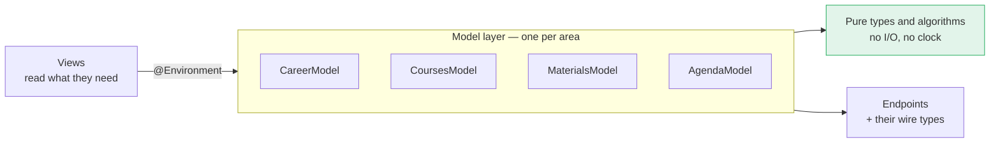
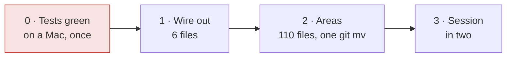

# Model layer: naming and structure

A plan for reorganising the 110 files that are not views: 49 in
`PoliVerse/Models`, 61 in `PoliVerse/Services`.

Nothing here has been done. Numbers were measured on the branch this was
written from; proposals say so.

---

## 1. What is there today

| Folder | Files | Lines | What lives there |
| --- | ---: | ---: | --- |
| `PoliVerse/Models` | 49 | 7 100 | Domain types, wire types and pure algorithms, one flat list |
| `PoliVerse/Services` | 61 | 11 532 | 27 `@Observable` models, 20 pure `enum`s, 4 actors, 20 that do networking, one flat list |
| `PoliVerse/Features` + `NewUI` | 93 | 19 851 | The two interfaces |
| `Shared` | 8 | 1 021 | What the widget extension needs too |

One app target. Xcode file-system-synchronized groups, so **moving a file on
disk does not touch `project.pbxproj`** — which is what makes this cheap to do
and cheap to undo.

Three facts worth having before deciding anything:

- **The model layer does not import SwiftUI.** One file does —
  `Services/AuthWebView.swift` — and it is a view in the wrong folder. There is
  no dependency direction to straighten out here, only filing.
- **`Session` is named by 49 files**, a quarter of the app, and holds four
  unrelated things: who the student is, the OAuth session, the sample-data
  switch, and login orchestration.
- **Six files hold both the shape the Politecnico sends and the shape the app
  reasons about** (`Career`, `Classroom`, `Course`, `Libretto`,
  `PoliMiProfile`, `User`). The endpoints move without notice
  (`docs/endpoint-status.md`), so this is the one boundary that has a real
  failure mode rather than a legibility complaint.

Only the third is a defect. The first two are the app being harder to read
than it needs to be — which is worth fixing, but not worth pretending is
urgent.

---

## 2. The architecture the app already has: MV

`PoliVerseApp` injects **27 `@Observable` objects** into the environment, and
views read them directly. There is not one `ViewModel` in the repository.

That is Model–View. Apple does not name a pattern, but its data-flow guidance
and sample code do exactly this: model types in the environment, SwiftUI
observing the properties a view actually reads, no object in between. The
community calls it MV.

So the question is not which architecture to adopt. It is whether the folders
say what the code already does. They do not.

**Why not MVC.** MVC's controller mediates between a view and a model because
UIKit's view cannot describe itself. A SwiftUI `View` is a description that
re-runs when the state it read changes — it is already the controller's job,
done by the framework. Adding controllers means writing by hand what
`@Observable` does, and introducing a layer with no state of its own.

**Why not MVVM.** A ViewModel per view duplicates the `View` struct: both
would hold per-screen state, and `@State` already does that without a second
type. MVVM earns its keep where a view framework cannot observe a model
directly. SwiftUI can.

**Why not the Clean/hexagonal shape** (an earlier draft of this document
proposed it): ports, gateways and adapters add three vocabulary items and a
wiring step at launch, to make testable something the test suite already tests
with `URLProtocol` stubs (`ConnectionProbeTests`, `RoomOccupancyTests`). That
is a layer bought at full price to replace a stub that works.

**What MV gets wrong, and the rule that fixes it.** MV's failure mode is one
enormous model object that the whole app depends on. This app already has it:
`Session`, fan-in 49. So the rule that matters is not a layering rule, it is
this one:

> **One model per area, never one model for the app.** A model owns one
> subject — the career, the courses, the materials — and knows nothing about
> the others.



---

## 3. The structure: one folder per area

The previous draft grouped by layer — `Domain/`, `Stores/`, `Gateways/`. That
was a mistake, and a measurable one: it spread Carriera across **four**
folders, where today it sits in two. The question asked every day is "where is
everything about the career?", and a layout should answer it in one place.

The layer belongs in the **file name**, where a reader sees it and the compiler
never needs it.

```
PoliVerse/
  App/                    entry point, routing, intents          (unchanged)
  DesignSystem/                                                  (unchanged)
  Views/                  Features/ + NewUI/ converge here, later
  Model/
    Career/               Career.swift · CareerModel.swift · CareerAPI.swift · Wire.swift
                          ExamTimeline.swift · ExamContext.swift · Libretto.swift
    Courses/              Course.swift · CoursesModel.swift · CoursesAPI.swift · Wire.swift
                          Teacher.swift · Enrolment.swift
    Materials/            WeBeepFile.swift · MaterialsModel.swift · WeBeepAPI.swift · Wire.swift
                          MaterialChange.swift · DocumentClassifier.swift
    Timetable/            PersonalTimetable.swift · AgendaModel.swift · AgendaAPI.swift
                          CalendarExport.swift
    Places/               Classroom.swift · RoomsModel.swift · RoomsAPI.swift · Wire.swift
                          RoomBooking.swift · RoomFacility.swift · MapPlacement.swift
    Study/                Manifesto.swift · ManifestiModel.swift · ManifestiAPI.swift
                          StudyPlan.swift · StudyProgramme.swift
    Updates/              ExamUpdate.swift · UpdatesModel.swift · FeedItem.swift
                          Notice.swift · NewsItem.swift · NotificationPlan.swift
    Identity/             User.swift · IdentityModel.swift · AuthModel.swift
                          Tokens.swift · PoliMiOAuth.swift · LoginWebKit.swift · CieID.swift
    Platform/             SpotlightIndex · LiveActivityController · WidgetReloader
                          NotificationService · CalendarExporter · BackgroundRefresh
    Diagnostics/          DiagnosticsLog · DiagnosticsReport · ConnectionProbe
                          StorageAudit · PerformanceMonitor · PerfSignpost
    Support/              shared by every area, depends on none of them
                          PoliMiAPI · ServiceDirectory · DiskCache · OfflineStore
                          KeychainStore · ActionQueue · HTMLText · HTMLScraper
                          RegexCache · JSONValue · SearchMatch
  Shared/                 app + widget extension                 (unchanged)
```

Suffixes carry the role, and are the whole convention:

| Suffix | What it is | How it is tested |
| --- | --- | --- |
| *(none)* | Value types and pure algorithms. No I/O, no clock of its own. | In memory, in milliseconds |
| `…Model` | The `@Observable` a view reads. `@MainActor`. Holds no parsing and no `URLSession`. | Driven through its API with a `URLProtocol` stub |
| `…API` | One endpoint family. Returns the area's own types, never wire types. | `URLProtocol` stub |
| `Wire` | The `…DTO`s of that area, `internal` to it, never in a signature a view can see. | The decoding tests that exist |

`CareerService` becomes `CareerModel` because it is a model, not a service.
`WeBeepAPI` already says what it is. `ManifestoParser` keeps no suffix because
it is pure. A folder should not need a glossary to be read correctly.

---

## 4. Three rules, in place of a matrix

1. **`Support/` names no area.** If something in `Support/` needs to know about
   Carriera, it belongs in `Model/Career/`.
2. **An area names no other area.** Where two must meet — a course and its
   sittings — the view that shows both does the meeting, or a pure type in
   `Support/` takes both as arguments.
3. **Nothing under `Model/` imports SwiftUI.** True today except for one
   misplaced file; a grep keeps it true.

All three are greppable. A five-line script in CI is enough, and can be added
before anything moves, so the rules are in force while the moving happens.

---

## 5. The path

**Precondition, not a phase.** The unit suite and the UI suite have to run
green on a Mac, once, before any file moves. The repo has no CI — no
`.github` at all — and the UI suite has never been compiled, so the safety net
every step below leans on is, at the moment, unproven. Tensioning it is step
zero and it is not optional.

Then three steps, three pull requests:

| Step | What | Touches logic | Effort |
| --- | --- | :-: | --- |
| **1** | Split the six files that hold both a DTO and a domain type; the DTOs become `Wire.swift` in their area, `internal`. | no | half a day |
| **2** | `git mv` the 110 files into `Model/<Area>/`, and rename `…Service` to `…Model` / `…API` where the name lies. `AuthWebView` goes to the views. | no | a day, one PR |
| **3** | Split `Session` into two: **who the student is** and **how they got in**. The sample-data flag goes with the first. | **yes** | a day |

Nothing else. `Session` is split into two rather than four because a type for
one boolean is not a type. The two interfaces converge when it is decided which
one ships — that is a product question, and filing does not answer it.



Every step is a `git mv` plus renames, so a step is abandoned with
`git revert` and nothing is left behind.

---

## 6. What this plan refuses

- **SPM modules, for now.** All 100 test files import
  `@testable import PoliVerse`. Splitting the target breaks every one of them,
  and `@testable` does not cross a module boundary the way a single target
  allows. The folder move changes **no import statement at all**, because one
  target needs none. Revisit only if build time is measured and found wanting.
- **A dependency-injection framework.** `@Environment` is the injection
  mechanism SwiftUI already provides, and 27 registrations at the root are a
  graph you can read. A container would hide it.
- **Ports and protocols between a model and its API.** The `URLProtocol` stubs
  already in the suite do that job with no extra type.
- **ADR files.** `docs/` is already a decision record, written better than any
  template.
- **Restructuring the views.** Later, and only after the interface question is
  settled.

---

## 7. Open questions

1. **`Features/` vs `NewUI/`.** Is the old interface going away? Step 2 does
   not depend on the answer; the view reorganisation does entirely.
2. **`Shared/` and the areas.** `AgendaEvent`, `PoliMiDate`,
   `FreeRoomsSnapshot`, `CareerSnapshot` and `RoomOccupancy` are needed by the
   widget and so live in `Shared/`, which means Timetable and Places will each
   sit in two places. Leaving them and saying so is defensible; the
   alternative needs the SPM question reopened.
3. **`ExamContext` and `ExamTimeline`** read sittings, the libretto and updates
   together. `Model/Career/` is proposed above; a case can be made for a small
   area of their own.
