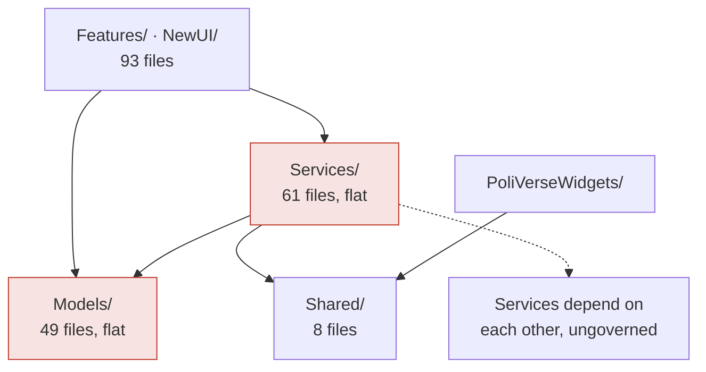
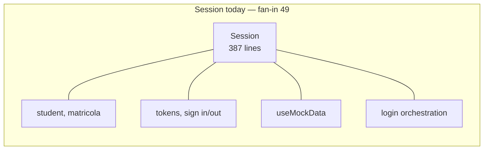
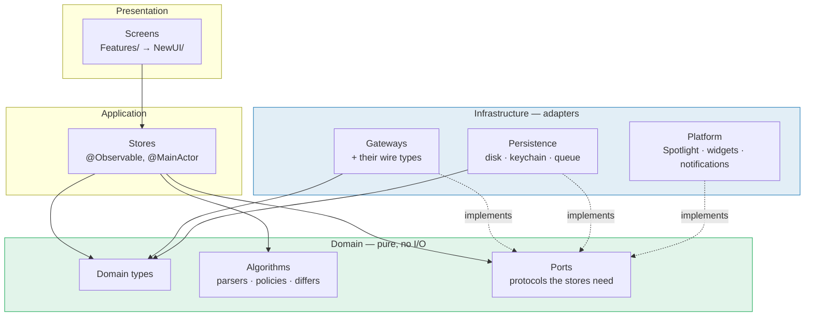
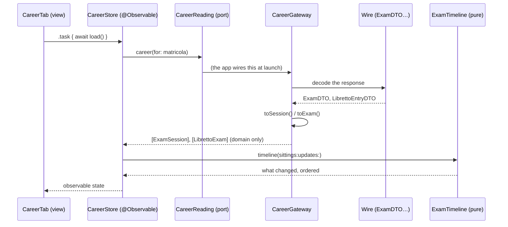
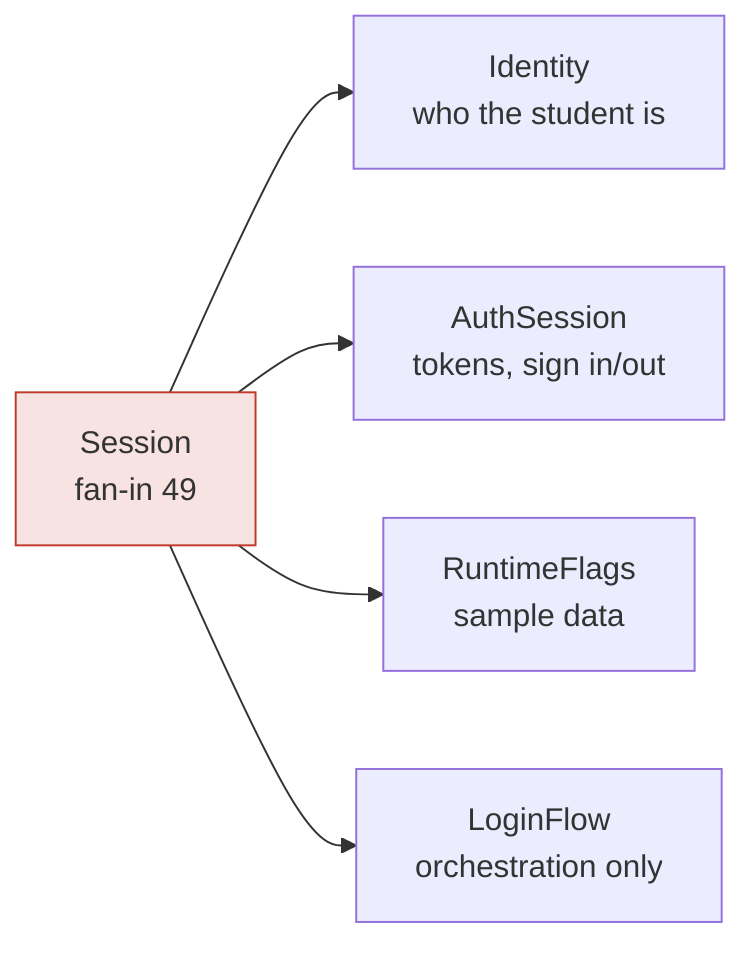
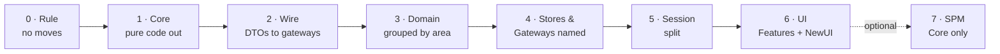

# Data layer architecture

A plan for reorganising everything in the app that is not a view: the 49 files
in `PoliVerse/Models`, the 61 in `PoliVerse/Services`, and the 8 in `Shared`.

Nothing here has been done. This is the document to argue with before any file
moves. Where it states a fact about the code as it stands, the number was
measured on the branch this was written from; where it proposes something, it
says so.

---

## 1. What is there today

| Folder | Files | Lines | What lives there |
| --- | ---: | ---: | --- |
| `PoliVerse/Models` | 49 | 7 100 | Domain types, wire types, and pure algorithms, in one flat list |
| `PoliVerse/Services` | 61 | 11 532 | Observable stores, actors, network gateways and pure helpers, in one flat list |
| `PoliVerse/Features` | 50 | 10 602 | The screens of the interface being replaced |
| `PoliVerse/NewUI` | 43 | 9 249 | The screens of the interface that ships |
| `PoliVerse/DesignSystem` | 7 | 718 | Theme, cards, previews |
| `PoliVerse/App` | 5 | 510 | Entry point, routing, intents |
| `Shared` | 8 | 1 021 | Types the widget extension needs too |
| `PoliVerseWidgets` | 9 | 1 368 | The widget extension |

One app target. Xcode file-system-synchronized groups, so **moving a file on
disk does not touch `project.pbxproj`** — which is what makes a restructuring
of this size cheap to do and cheap to undo.



The layering is already right in the one way that matters most: **the data
layer does not import SwiftUI.** One file does — `Services/AuthWebView.swift`,
which is a view sitting in the wrong folder. That is the whole leak. Everything
below is about organisation and coupling, not about a tangled dependency
direction, which is a much better starting point than it could have been.

### 1.1 The four problems, with evidence

**A flat folder is not a structure.** 61 files in `Services/` hold at least
four different kinds of thing:

| Kind | Count | Examples |
| --- | ---: | --- |
| `@Observable` stores (state the UI reads) | 27 | `CareerService`, `AgendaService`, `WeBeepService` |
| Pure `nonisolated enum` (no state, no I/O) | 20 | `JSONShape`, `OnboardingFlow`, `LoadWindow` |
| `actor` (serialised state) | 4 | `TokenStore` and friends |
| Does networking | 20 | `PoliMiAPI`, `CourseService`, `RoomsService` |

These have different testing needs, different concurrency rules and different
reasons to change. Nothing in the folder name says which is which, so the only
way to know what a file is, is to open it.

**`Session` is a god object.** It is named by **49 files** — a quarter of the
app. It holds at least four unrelated responsibilities: who the student is, the
OAuth session and its tokens, the sample-data switch, and login orchestration.
Every screen that needs any one of them depends on all four.



**Wire types and domain types share a file.** Six files hold both the shape the
Politecnico sends and the shape the app reasons about: `Career.swift`,
`Classroom.swift`, `Course.swift`, `Libretto.swift`, `PoliMiProfile.swift`,
`User.swift`. Fourteen `Models` files mention `Decodable` at all. The endpoints
are private and change without notice (`docs/endpoint-status.md`), so the
boundary between "what they sent" and "what we mean" is the one boundary this
app most needs to be able to move.

**Screens know the whole service graph.** `@Environment` dependencies per view:

| View | Services injected |
| --- | ---: |
| `HomeView` | 14 |
| `PersonalTimetableView` | 10 |
| `ConnectionsView` | 9 |
| `SearchView`, `ExamUpdatesView`, `CourseInfoView`, `CourseDetailView` | 8 |

A view with fourteen dependencies cannot be reasoned about, previewed cheaply,
or moved. It is also a symptom rather than a cause: there is no unit of
"everything the Home screen needs", so the screen assembles one by hand.

### 1.2 What is already good, and must not be lost

- The data layer is free of SwiftUI (one misplaced file aside).
- 20 pure `enum`s with no state — the parsers, the classifiers, the policy
  engines — are already the most valuable and most testable code in the repo.
- 100 test files cover it. That test suite is the safety net that makes this
  restructuring possible at all, and every phase below is verified by it.
- `Shared/` already draws a real boundary: the app and the widget extension.

---

## 2. Where this is going

### 2.1 Three principles

**One direction.** Dependencies point inward, towards code that knows nothing
about the outside world. The inner layers may not name the outer ones. This is
the dependency rule of Clean Architecture ([Martin, 2012][clean]) and the same
idea as ports and adapters ([Cockburn, 2005][hex]); the names differ, the rule
does not.

**Three kinds of code, never mixed in one file.**

| Kind | Rule | How it is tested |
| --- | --- | --- |
| **Pure** — value types, parsers, policies | No I/O, no clock of its own, no global state. `nonisolated`. | Swift Testing, in memory, in milliseconds |
| **Gateway** — talks to a service | Owns one endpoint family. Returns domain types, never wire types. | `URLProtocol` stub |
| **Store** — state the UI observes | `@Observable`, `@MainActor`. Holds no parsing and no `URLSession`. | Driven through its gateway's stub |

**Wire is not domain.** Every `…DTO` is an implementation detail of one
gateway. It is declared next to that gateway, it is `internal` to its area, and
it never appears in a function signature a screen can see. When the Politecnico
moves an endpoint — which the docs record happening repeatedly — exactly one
file changes.

### 2.2 The target shape



The arrow that matters is the dotted one: infrastructure depends on the domain,
never the other way round. A store asks for "the career of this student"
through a protocol the domain declares; which endpoint answers is not its
business.

### 2.3 The folders

```
PoliVerse/
  App/                        entry point, routing, intents          (unchanged)
  DesignSystem/                                                      (unchanged)
  UI/
    Today/  Courses/  Career/  Search/  Settings/  Onboarding/
                              ← Features/ and NewUI/ converge here, later
  Data/
    Core/                     pure, depends on nothing
      Text/                   HTMLText · HTMLScraper · RegexCache · SearchMatch
      Time/                   LoadWindow          (PoliMiDate stays in Shared — see §7.4)
      JSON/                   JSONValue · JSONShape · PayloadInspector
    Domain/
      Career/                 Career · Libretto · ExamTimeline · ExamContext · PartialExams
      Courses/                Course · Teacher · Enrolment · CourseHubBadges
      Materials/              WeBeepFile · Moodle · MaterialChange · DocumentClassifier · Assignment
      Timetable/              PersonalTimetable · CalendarExport
                              (AgendaEvent stays in Shared — see §7.4)
      Places/                 Classroom · RoomBooking · RoomFacility · BuildingLocation · MapPlacement
      Study/                  Manifesto · StudyPlan · StudyProgramme · SyllabusPicker
      Updates/                ExamUpdate · FeedItem · Notice · NewsItem · NotificationPlan
      Identity/               User · Tokens · PoliMiProfile · PoliMiLanguage
    Stores/
      CareerStore · CoursesStore · MaterialsStore · AgendaStore · RoomsStore ·
      UpdatesFeed · …          ← today's *Service classes, renamed for what they are
    Gateways/
      PoliMiAPI/              APIRequest · ServiceDirectory · retry · profile headers
      Career/  Courses/  Materials/  Agenda/  Rooms/  Manifesti/  News/
                              each with its own Wire.swift
    Persistence/              DiskCache · OfflineStore · KeychainStore · ActionQueue · ReportArchive
    Platform/                 SpotlightIndex · LiveActivityController · WidgetReloader ·
                              NotificationService · CalendarExporter · BackgroundRefresh
    Diagnostics/              DiagnosticsLog · DiagnosticsReport · ConnectionProbe · StorageAudit ·
                              ScopeAudit · PerformanceMonitor · PerfSignpost · PerformanceStates
    Auth/                     PoliMiOAuth · TokenStore · LoginWebKit · CieID · SPIDCatalogue ·
                              AuthSession
  Shared/                     app + widget extension                 (unchanged boundary)
```

Names change where the current one hides what a type is: `CareerService` is a
store, `WeBeepAPI` is a gateway, `ManifestoParser` is pure. A folder should not
need a convention document to be read correctly.

### 2.4 One vertical slice, in full

What "Carriera" looks like once it is arranged this way:



The test for `ExamTimeline` needs no network and no store. The test for
`CareerStore` needs a stub port, not a `URLProtocol`. The test for
`CareerGateway` needs a `URLProtocol` and no store. Each is the cheapest test
that can fail for the right reason — which is the point of the arrangement, not
a side effect of it.

### 2.5 Breaking up `Session`



Most of the 49 dependants want `Identity` alone — a matricola and a name. A few
want `RuntimeFlags` to say "this is sample data". Only the login screens want
`AuthSession` or `LoginFlow`. Splitting turns one 49-way dependency into four
small ones, and makes it possible to preview a screen without an auth stack.

Do this **last** among the code moves (phase 5): it is the only phase that
changes call sites rather than file paths, and it wants the rest to be stable
underneath it.

---

## 3. The dependency rule, written so it can be checked

| From ↓ may import → | Core | Domain | Stores | Gateways | Persistence | Platform | UI |
| --- | :-: | :-: | :-: | :-: | :-: | :-: | :-: |
| **Core** | ✓ | ✗ | ✗ | ✗ | ✗ | ✗ | ✗ |
| **Domain** | ✓ | ✓ | ✗ | ✗ | ✗ | ✗ | ✗ |
| **Stores** | ✓ | ✓ | ~ | ✗¹ | ✗¹ | ✗¹ | ✗ |
| **Gateways** | ✓ | ✓ | ✗ | ✓ | ✓ | ✗ | ✗ |
| **Persistence** | ✓ | ✓ | ✗ | ✗ | ✓ | ✗ | ✗ |
| **Platform** | ✓ | ✓ | ✗ | ✗ | ✓ | ✓ | ✗ |
| **UI** | ✓ | ✓ | ✓ | ✗ | ✗ | ✗ | ✓ |

¹ Through a port declared in `Domain`, never by naming the concrete type.
~ A store may read another store; that edge is allowed but counted, because it
is how a second god object gets built.

Two ways to enforce it, and the honest difference between them:

**A script, in CI.** Greps imports and folder paths against the table. Cheap,
runs on Linux, catches the common case, and can be added *before* any file
moves so the rule is in place while the moving happens. It cannot see through
`@testable` or type inference: it is a lint, not a proof.

**SPM modules.** The compiler enforces it, exactly, with no script to maintain.
The cost is stated in §5 and it is not small.

Start with the script. Reach for modules only where the boundary has proved
worth paying for.

---

## 4. Migration, in phases

Each phase is a pull request, reversible on its own, and green before the next
begins. "Green" means the unit suite plus the UI suite — the navigation, search,
lifecycle and accessibility walks are the net that catches a move that compiled
but broke the app (`docs/testing.md`).



| Phase | What moves | Touches logic? | Risk | Verified by |
| --- | --- | :-: | :-: | --- |
| **0** | Nothing. The import-rule script, and an `docs/adr/` folder with this document's decisions. | no | none | The script passes on the current tree, or its first report is the backlog |
| **1** | The ~20 pure files into `Data/Core/` and `Data/Domain/*/`. Pure code has no dependants to break beyond its name. | no | low | Unit suite |
| **2** | Each `…DTO` out of its shared file into its gateway's `Wire.swift`; make it `internal` to the area. | no¹ | medium | Unit suite — the decoding tests are the check |
| **3** | The remaining `Models/` into `Data/Domain/<Area>/`. | no | low | Unit suite |
| **4** | `Services/` split into `Stores/`, `Gateways/`, `Persistence/`, `Platform/`, `Diagnostics/`, `Auth/`; rename to match. `AuthWebView` moves to the UI. | no | medium | Unit + UI suites |
| **5** | `Session` into `Identity`, `AuthSession`, `RuntimeFlags`, `LoginFlow`. | **yes** | **high** | Unit + UI suites; the signed-out and onboarding walks especially |
| **6** | `Features/` and `NewUI/` converge into `UI/<Area>/`; the interface that is not shipping is deleted rather than moved. | **yes** | **high** | Full UI suite, screenshot sweep before/after |
| **7** | *Optional.* `Data/Core` becomes a local SPM package. | no | medium | Build time measured before and after |

¹ Phase 2 changes no behaviour, but it does change access levels, which the
compiler will find. Expect the diff to be wide and shallow.

**Order is not arbitrary.** Pure code first, because it is the only code that
can move with no dependants breaking. Wire types next, because that boundary is
the one the endpoints keep forcing. `Session` late, because it is the only step
that edits call sites across the app, and doing it on a tree that is still
moving underneath means two hard problems at once. The UI last, because the two
interfaces are a product decision, not a filing one.

**Every phase is a `git mv`.** With synchronized groups there is no project file
to merge, so a phase can be abandoned with `git revert` and nothing is left
behind.

---

## 5. Should this become SPM modules?

Not yet, and here is the number that decides it: **all 100 test files import
`@testable import PoliVerse`.** Splitting the app target into modules breaks
every one of them, and `@testable` does not cross a module boundary the way a
single target lets it — internal types that tests reach today would need to
become `public`, or the tests would need to move into the module that owns
them.

That is not an argument against modules for ever. It is an argument for:

1. doing the folder restructuring first, where **no import statement changes at
   all**, because one target needs none;
2. proving the boundary is real with the lint;
3. then extracting **`Data/Core` alone** — pure code, no dependants outside the
   app, the tests for it move with it — and measuring what it buys in build
   time before extracting a second.

A module split that is done for tidiness costs real time and buys nothing a
folder plus a lint does not. A module split done to make a boundary
compiler-enforced, on a boundary that has already proved itself, is worth it.

---

## 6. What not to do

- **Do not introduce a repository protocol per type.** Ports exist where a
  store needs to be tested without a network, not as a matter of course. One
  port per area, not one per noun.
- **Do not move `Shared/`.** Its boundary is a real one — two processes — and
  it is already right.
- **Do not mix a rename with a move in the same commit.** `git mv` alone keeps
  the history readable; a rename on top of it does not.
- **Do not restructure the UI while the two interfaces both exist.** Decide
  which one ships first; filing does not resolve a product question.
- **Do not add a dependency-injection framework.** `@Environment` plus ports is
  enough at this size, and a container would hide exactly the graph this plan
  is trying to make visible.

---

## 7. Open questions

1. **`Features/` vs `NewUI/`.** Is the old interface going away? Phase 6 is
   cheap if it is deleted, expensive if both must live.
2. **Ports: how far?** The table assumes stores reach infrastructure through
   protocols. That is worth it for the seven gateways that do networking; it is
   probably not worth it for `DiskCache`.
3. **Where does `ExamContext` belong?** It reads a sitting, the libretto and
   other sittings together. Either `Domain/Career/`, or a `Domain/Insight/`
   that also takes `ExamTimeline` and `PartialExams`.
4. **`Shared/` and the domain.** Some domain types the app would want in
   `Data/Domain/` are needed by the widget too, and so live in `Shared/`:
   `AgendaEvent` and the `PoliMiDate` helpers inside it, `FreeRoomsSnapshot`,
   `CareerSnapshot`, `RoomOccupancy`. The tree above leaves them where they
   are, which means one area's types sit in two places. Either `Shared/` grows
   to hold the whole of those areas' domains, or `Domain/` is extracted as a
   module both targets depend on — which needs the SPM question in §5 answered
   first. Leaving it as it is, and saying so, is also a defensible answer.

---

[clean]: https://blog.cleancoder.com/uncle-bob/2012/08/13/the-clean-architecture.html
[hex]: https://alistair.cockburn.us/hexagonal-architecture/
