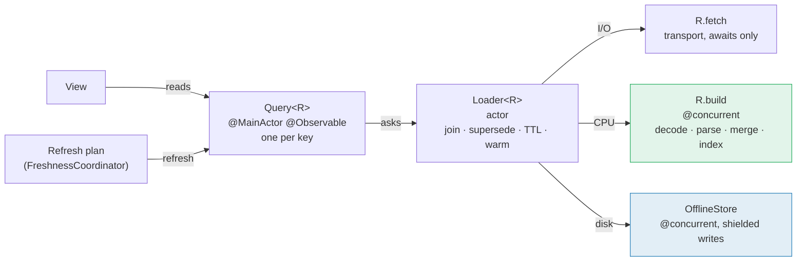

# Loading data and using threads: a target architecture

Written 2026-09-29 as a proposal; steps 1–6 are implemented on
`refactor/data-loading` (see §8 for where the code differs from the plan). Sources: the WWDC25
sessions this project already follows ([Embracing Swift concurrency](https://developer.apple.com/videos/play/wwdc2025/268/),
[Explore concurrency in SwiftUI](https://developer.apple.com/videos/play/wwdc2025/266/)) and WWDC26's
[Profile, fix, and verify (268)](https://developer.apple.com/videos/play/wwdc2026/268/),
[What's new in Swift (262)](https://developer.apple.com/videos/play/wwdc2026/262/) and
[What's new in SwiftUI (269)](https://developer.apple.com/videos/play/wwdc2026/269/).
Every API named below was checked against the Xcode 27.2 SDK (Swift 6.4).

---

## 0. The verdict

**Not a rewrite.** The foundations are the ones Apple recommends and they are
right: `@MainActor @Observable` models read directly by views, an offline copy
per account, decoding off the main actor, coalesced requests. What is wrong is
that the app solves "load this, keep it fresh, don't do it twice" **five
different ways**, and every bug found this week lived in the gaps between them.

The proposal is one loading pipeline for every remote resource, and four
explicit lanes for where code runs. Everything else stays.

---

## 1. What is there

| Mechanism | Who uses it | Joins a second caller? | Offline copy | Where it runs |
| --- | --- | --- | --- | --- |
| `Store<Source>` | Career, Courses, Notices, News | **No** — returns at once | yes | main actor, decode `@concurrent` |
| `ResourceLoader` | Free rooms, facilities, Manifesti | yes | no | actor |
| `LoadWindow` + `CachedSlot` by hand | Agenda, WeBeep, recordings | **No** (`isLoading`) | yes | main actor |
| Own flags | Campus map, rooms, programmes, personal timetable | **No** | some | main actor |
| `FreshnessCoordinator` | orchestrates six of the above through closures | yes | — | main actor |

The bugs fixed on 2026-09-28, by mechanism:

| Bug | Cause | Mechanism |
| --- | --- | --- |
| Lectures wiped when only deadlines answered | merge written by hand, per model | hand-rolled |
| Campus switched mid-pass showed the old campus | `isLoading` **dropped** a request for a different key | own flag |
| Reminders from two plans left pending | two main-actor calls interleaving across `await` | none — reentrancy |
| Agenda tests passing or failing by order | offline copy keyed by account, shared between tests | `CachedSlot` |

The same pattern is still in the code:

- `AgendaModel.load` starts with `guard !isLoading`. Paging the calendar while
  the launch refresh runs asks for a week the model does not hold, and the
  request is dropped: the week shows empty until the next page.
- `Store.load` starts with `guard phase != .loading`. A pull-to-refresh during
  the launch refresh returns at once, so the spinner ends before any data
  arrives.
- `ManifestiModel.swift:132` parses a search page with `ManifestoParser` on the
  main actor. The parsers are synchronous `nonisolated` functions, and a
  synchronous function runs on whoever calls it.

---

## 2. Eight rules

1. **The main actor holds state and assigns it. Nothing else.** No decoding,
   parsing, sorting, merging or indexing of a payload runs there. (WWDC25 268)
2. **`nonisolated` does not mean "off the main thread".** With Approachable
   Concurrency on (it is), an `async` `nonisolated` function runs on its
   caller's actor (`nonisolated(nonsending)`), and a synchronous one always
   does. **Only `@concurrent` leaves.** Every function that walks a payload is
   `@concurrent` and `async`. (WWDC25 268; WWDC26 268 does exactly this for its
   thumbnail and file write)
3. **Join, don't drop.** A second request for the same thing awaits the first.
   Returning early looks like "done" to the caller.
4. **The newest request wins, by key.** A request for another day, campus or
   week supersedes, and a superseded pass never writes.
5. **Priority follows why the work runs.** Something on screen inherits the
   view's priority. Warming what is about to be on screen is `.utility`.
   `.background` belongs to the background refresh task, where the system
   already runs you at that level. When a user asks for something already being
   warmed, the warming is raised to their priority
   (`Task.escalatePriority`, and awaiting a task's value does it too).
6. **Cancellation belongs to the last caller still waiting.** Work survives one
   caller leaving, and stops when nobody is waiting. A write to the offline copy
   is never cut in half: `withTaskCancellationShield` (Swift 6.4, SE-0504).
7. **Observe per key.** A view depends on the day, week or room it read, never
   on the whole collection. `AgendaModel.Slice` already does this by hand; it
   becomes the default.
8. **Name every task and signpost every lane.** `Task(name:)` makes the Swift
   Concurrency instrument (Instruments 27) readable, and a signpost per lane
   makes Instruments' run comparison possible. (WWDC26 268)

---

## 3. The shape



### A resource describes one kind of data, and does no work of its own

```swift
nonisolated protocol Resource: Sendable {
    associatedtype Key: Hashable & Sendable
    associatedtype Wire: Sendable              // what the transport returns
    associatedtype Value: Codable & Sendable   // what the app reasons about

    static var id: String { get }
    static var freshness: Freshness { get }    // TTL, and whether stale is shown
    static var persistence: Persistence { get } // .memory, or .offline per account

    /// I/O only: build the request, await the bytes.
    func fetch(_ key: Key, env: Env) async throws -> Wire

    /// Everything that costs CPU, off the main actor. Gets what was held, so a
    /// partial failure is decided here, once, as a pure function.
    @concurrent
    func build(_ wire: Wire, key: Key, previous: Value?) async throws -> Value

    func sample(_ key: Key) -> Value
}
```

`build` taking `previous` is the point. "Lectures failed, keep the lectures
held" and "deadlines failed, keep the deadlines" become one pure function with
parameterized tests, not merge logic inside a `@MainActor` model.

### One loader per resource, one actor each

```swift
actor Loader<R: Resource> {
    /// Joins a fetch in flight for the key, raising its priority to the caller's.
    func snapshot(_ key: R.Key, force: Bool = false) async -> Snapshot<R.Value>
    /// Warms keys at `.utility`. Never observed, never on screen.
    func warm(_ keys: some Sequence<R.Key>)
    /// Every change for one key: the offline copy, then each fetch.
    func updates(_ key: R.Key) -> AsyncStream<Snapshot<R.Value>>
}

nonisolated struct Snapshot<Value: Sendable>: Sendable {
    var value: Value?
    var fetchedAt: Date?
    var phase: Phase          // .fresh, .stale, .refreshing, .failed(message)
}
```

It is today's `ResourceLoader` plus what `Store` and `CachedSlot` do: TTL,
the offline copy, the account key, the signpost. **One actor per resource, not
one for the app.** A single data actor would serialise every screen's loading
behind one executor, which is the contention the Swift Concurrency instrument
exists to show.

### The observable handle a view reads

```swift
@MainActor @Observable
final class Query<R: Resource> {
    private(set) var snapshot: Snapshot<R.Value>   // assigned only when it changed
    func refresh(force: Bool = false) async         // joins; returns when data is in
}
```

Area models keep their own API — `agenda.events(on:)`, `career.sessions` —
and hold queries underneath. Views change nowhere.

### Four lanes

| Lane | Runs on | Priority | What belongs there |
| --- | --- | --- | --- |
| **UI** | main actor | the view's | `@Observable` state, assignment, navigation. Nothing proportional to a payload |
| **I/O** | whoever awaits it (`nonsending`) | inherited | `URLSession`, WebKit. Awaiting costs no thread |
| **Compute** | `@concurrent`, global pool | inherited, escalated on await | JSON decode, HTML parsers, indexes by day and title, `TimetableMerge`, `NotificationPlan.build`, `FeedItem` diffing, search |
| **Disk** | `@concurrent`, ordered per file | `.utility`, escalated on await | `OfflineStore`, `DiskCache`, downloads' bookkeeping |

Actors hold coordination state only: caches, in-flight tasks, token refresh.
`Mutex` (`Synchronization`) is for small synchronous state that is read from
several lanes and never awaited, such as the regex cache.

---

## 4. What happens to each part

| Today | Becomes | Why it is better |
| --- | --- | --- |
| `AgendaModel`: a ±month window, `loadedSpans`, `isLoading` | `AgendaWeek: Resource`, keyed by Monday. Paging asks for new keys | Today's week is its own key and can never be dropped. The spans, the hull, the merge by window and the dropped page all disappear. The indexes are built in `build`, off the main actor |
| `AgendaModel.Slice` | `Query<AgendaWeek>`, plus a per-day projection | Per-key observation becomes the default |
| `Store<Source>` (Career, Courses, Notices, News) | `Loader` + `Query`, keyed by `Void` | Mechanical port; gains "join, don't drop" |
| `ResourceLoader` (Free rooms, facilities, Manifesti) | `Loader` | Same semantics; gains the offline copy where wanted |
| Free rooms' campus pass | A task group over `(room, day)` keys, one generation per `(day, campus)` | The supersession fixed by hand yesterday comes from the loader |
| `ManifestoParser`, `RecmanParser`, `PersonalTimetableParser` called from models | Inside `build` | Off the main actor by construction |
| `CachedSlot` claim/finish | Inside the loader | The restore race is handled once |
| `LoadWindow` | `Freshness` on the resource | One TTL rule instead of two |
| `FreshnessCoordinator` | A refresh plan over queries, run in a `withDiscardingTaskGroup`, each child named | Same order and joining, readable in Instruments |
| `NotificationModel.reschedule` | A small actor that owns the pending plan, newest plan wins | The generation guard added yesterday, made structural |
| Prefetch `Task.detached(priority: .background)` | `loader.warm(keys)` at `.utility` | Warming no longer starves; a tap escalates it |
| `BackgroundRefresh` | The same loaders, run from the refresh task | One code path for foreground and background |

---

## 5. Order of work

Each step ships on its own, with the unit suite green and a before/after
measurement.

| Step | What | Size |
| --- | --- | --- |
| **1. Rules, without new types** | `@concurrent` on the parsers, indexes and planners models call directly (start with `ManifestiModel.swift:132`). Warming at `.utility`. `Store.load` and `AgendaModel.load` join instead of returning early. `Task(name:)` on every long-lived task | small |
| **2. Pilot** | `Resource`, `Loader`, `Query` beside what exists. Port `NewsModel` (43 lines), then Notices | medium |
| **3. Store users** | Career and Courses. Delete `Store` | medium |
| **4. Agenda by week** | The biggest win, and it deletes the most code | large |
| **5. ResourceLoader users** | Free rooms, facilities, Manifesti. Delete `ResourceLoader`, `CachedSlot`, `LoadWindow` | medium |
| **6. The rest** | WeBeep, recordings, campus map, programmes, one at a time | medium each |

Step 1 alone removes most of the risk. Steps 2–6 are about having one way to do
it, so the next bug is fixed once.

### After the loading work: recording downloads

Downloads already run on a background `URLSession`, so they continue with the
app suspended or closed by the system; a force quit or a phone switched off
stops them, and the saved resume data picks them up again. None of the items
below is about threads: all of it happens outside the process.

| Step | What | Notes |
| --- | --- | --- |
| **7. Live Activity for a download** — done | "Analisi 1 — 45%" on the Lock Screen and in the Dynamic Island, updated from the session delegate's progress, ended on finish, failure or cancel | Reuses `LiveActivityController`. Throttle updates: the system budgets them |
| **8. Wi-Fi only, or cellular too** — done | A choice in Impostazioni, applied per request with `allowsExpensiveNetworkAccess` / `allowsConstrainedNetworkAccess` | A lecture is ≈ 90 MB an hour |
| **9. Recover an expired download** | On opening the app, a download stopped past the resume data's 80 minutes asks `/stream` for a fresh address and continues, instead of waiting in "interrotto" for a tap | Foreground only: a fresh address needs the Webex session in WebKit. Whether resume data survives the new address is unverified (`recordings.md`) |
| **10. A queue of lectures** | Several lectures asked for, downloaded one after another | A product decision first: `recordings.md` says one lecture at a time, on purpose |

---

## 6. What this refuses

- **One global data actor.** It serialises everything behind one executor.
- **Custom executors.** No measurement asks for one, and the Swift team's lab
  advice is not to add one without that.
- **SwiftData or Core Data.** The Politecnico owns the data. The app needs a
  cache, and `OfflineStore` is one.
- **Actor-isolated models.** Observation and SwiftUI want the main actor. Models
  stay `@MainActor @Observable`; the work moves, not the state.
- **Combine.** `AsyncStream` and Observation cover it.
- **`@unchecked Sendable` to silence the compiler.** If a type needs it, it
  needs an actor or a `Mutex` instead.

---

## 7. How to tell it is better

- **Swift Concurrency instrument** on launch and on calendar paging: the main
  actor track should show assignments only, and no loader queued behind another.
- **Run comparison** (Instruments 27) on the `agenda.load`,
  `freshness.revalidate` and `offline.read` signposts, before and after each
  step, same device, interleaved.
- **`PoliVersePerformance`** on a device, and `PoliVerseRealData` for a real
  account: sample data is too small to show most of this (see
  `metrickit-performance.md` §5.3).
- **Tests.** `Loader` is tested once for joining, supersession, TTL, the offline
  copy and cancellation. Each `build` is a pure function with parameterized
  tests. A model no longer needs its own concurrency tests.

---

## 8. What was built

Steps 1–6 as planned, with these differences:

- **One `fetch`, not `fetch` + `build`.** `Resource.fetch(_:env:previous:)` is
  `@concurrent` and does both the waiting and the building: separating them
  bought nothing once the whole method runs off the main actor, and the career's
  six endpoints do not split into one wire value. `previous` stayed, for partial
  failures. A batch `fetch(_ keys:…)` exists for resources whose endpoint answers
  a span; its default fetches each key concurrently.
- **`sample(_:)` is optional.** Public data (rooms, occupancy, the catalogue) has
  none and is fetched as usual under sample data.
- **The offline copy is only for `Codable` values**, chosen at conformance time
  (`Resource.save`/`read` default to nothing, and to `OfflineStore` where the value
  is `Codable`). `Loader.put` files a value built from another fetch — a course's
  listing, built from its page.
- **The agenda keeps the widgets' file as its offline copy.** Weeks are held in
  memory by the loader; the merged agenda the widgets read is still written as
  `agenda` and restored from at launch, so the widgets' contract did not change.
  Weeks are fetched in runs of up to seven, one request per load.
- **Two passes are rules, not resources.** The free-rooms campus pass
  (`FreeRoomsModel.passIsDue`) and the WeBeep update sweep
  (`WeBeepModel.sweepIsDue`) aggregate many keys; each keeps a one-line freshness
  rule, tested, where `LoadWindow` was.
- **`NotificationModel` keeps a generation guard** rather than becoming an actor:
  a newer plan stops an older one mid-way, which is the property that mattered.
- **`FreshnessCoordinator` keeps its ordered passes**, now named tasks, since the
  status line reads failures in registration order.
- **Also fixed on the way**, each a request dropped rather than joined:
  `RoomsModel` (free rooms saw an empty catalogue at launch), `CampusMapModel`
  (a campus picked mid-load kept the old pins), `WeBeepModel.loadMaterials` (on
  the Mac, switching course mid-load kept the old files), `RecordingsModel` (a
  recording tapped while the list loaded had no address to play; recman's one
  browser session is now a queue), `CareersModel`.
- **Left as they are:** `UpdateFeed`'s feed rows are still built on the main
  actor, cached until the log changes: its accessors are synchronous and read by
  views. `Session` decodes a token and a profile on the main actor: constant size.
