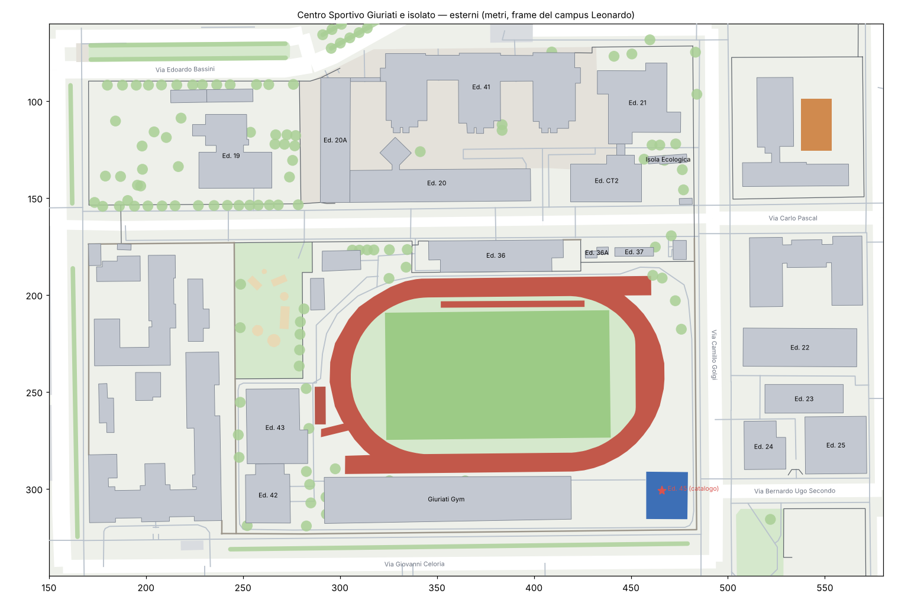

# Giuriati e dintorni — esterni 3D

Il Centro Sportivo Giuriati e il suo isolato (via Ponzio, via Bassini, via Golgi, via
Celoria), più il campus di via Golgi 40 dall'altra parte di via Golgi. Per ora c'è solo
l'esterno: suolo, verde, alberi, campi, pista, percorsi, recinzioni e arredi. Gli edifici
sono riconosciuti ed elencati qui sotto, nel modello sono solo l'impronta.



| File | Cosa contiene |
|---|---|
| `importa.py` | scarica i dati di OpenStreetMap (dalla copia di Overture Maps) e scrive `giuriati.json` |
| `giuriati.json` | verde, alberi, filari, campi, piste, percorsi, strade, recinzioni, muri, arredi, edifici, nel frame del campus |
| `esterni3d.py` | da `giuriati.json` a `giuriati.usdz` (e `giuriati.png` con `--png`) |
| `PoliVerse/Preview Content/Trifoglio3D/giuriati.usdz` | `Giuriati/Terreno`, `Sport`, `Verde`, `Arredi`, `Edifici/<csie>_Impronta` |

Stesso frame di `leonardo.json` e di `campus.usdz`: metri, X verso est, Y in alto, Z verso
sud, origine 45.48, 9.22803. Il file si sovrappone al campus senza spostamenti: la preview
"Trifoglio 3D" lo carica accanto a `campus.usdz`, e ne nasconde gli alberi dentro i piani
come quelli del campus.

```
python3 -m pip install pyarrow shapely trimesh mapbox_earcut numpy usd-core matplotlib
python3 importa.py giuriati.json --leonardo ../../../design/mappa/leonardo.json
python3 esterni3d.py giuriati.json "../../../PoliVerse/Preview Content/Trifoglio3D" --leonardo ../../../design/mappa/leonardo.json
python3 esterni3d.py giuriati.json . --png --leonardo ../../../design/mappa/leonardo.json   # solo per giuriati.png
```

`--leonardo` salta alberi, prati e percorsi che il file del campus ha già. Le chiavi di
`giuriati.json` sono quelle di `contesto` (verde, alberi, percorsi, strade, lampioni,
panchine…), più `campi`, `piste`, `filari`, `recinzioni`, `muri`, `pavimentate`,
`parcheggi` ed `edifici`, così si possono passare a `leonardo.json` quando lo si unisce.

## Perché Overture

Da questo ambiente `api.openstreetmap.org`, Overpass e le ortofoto non rispondono; la
release di Overture (`s3://overturemaps-us-west-2`, 2026-09-23.1, dati OSM del 6 settembre
2026) sì, e porta gli stessi oggetti con i tag e l'id OSM (`osm` in ogni voce del JSON).

## Cosa c'è nel modello

- **Pista di atletica** in tartan, l'anello intorno al campo da rugby con i prolungamenti
  dei due rettilinei, più due rettilinei di allenamento (uno dentro l'anello, sul lato nord,
  e uno accanto all'Arena); le corsie sono disegnate ogni 1,22 m.
- **Campo da rugby** in erba, con le strisce di falciatura e le righe (meta, 22, metà campo).
- **Padel coperto** (campi in sintetico sotto una copertura leggera), sul lato sud-est.
- **Area calistenica** in tartan accanto all'Arena, sette **giochi per bambini** nel
  giardino a ovest, il campo da **basket** della scuola Bono Cairoli oltre via Golgi.
- **Verde**: i prati di OSM e il prato dentro la pista; 127 alberi (con diametro della
  chioma dove OSM lo dà, se no 2,8 m di raggio) e 7 filari, un albero ogni 7 m.
- **Percorsi** pedonali e il "Percorso campestre" intorno alla pista, il **piazzale**
  pavimentato del nuovo campus di via Bassini, i parcheggi.
- **Recinzioni** (rete scura, 2,5 m) e **muri** (2 m), lampioni e panchine.

## Edifici da modellare

I codici vengono dal catalogo (`prototypes/map-view-PROTOTYPE/data.js`), abbinati agli
edifici di OSM per posizione; altezze e piani sono quelli di OSM, dove ci sono.

### Nuovi o cambiati di recente

| Edificio | Codice | Cosa è | Stato |
|---|---|---|---|
| Giuriati Gym | — | palestra con parete da arrampicata, 1700 m² coperti, due campi polivalenti (calcetto, tennis) sul tetto, rampe e ascensore esterno | inaugurata l'8 settembre 2026; in OSM c'è ancora il cantiere (2914 m², lato sud della pista), usato come impronta |
| Edificio 41 | MIA0314 | nuovo edificio del DCMIC (Chimica, Materiali e Ing. Chimica) e del DEIB: pianta a pettine con tre ali verso sud, 7 piani in OSM, pannelli neri e connettori vetrati | modellato con il guscio proprio (`gusci/MIA0314.py`, scheda in `design/mappa/bassini.json`): qui la sua impronta non si disegna più |
| Edificio 20A | MIA0319 | ampliamento del DEIB unito all'Edificio 20 "Carlo Pascal", 4 piani, facciata bianca lunga sul giardino con frangisole | finito, dicembre 2025 |
| Edificio 45 | MIA0320 | nel catalogo, non in OSM; sta sopra i campi da padel coperti, quindi probabilmente è la loro copertura | da verificare |
| Edificio 42 | MIA0315 | "Giuriati Fit Center", 2 piani | in OSM |
| Edificio 43 | MIA0316 | "Giuriati Arena", palazzetto volley/basket, 7,3 m | in OSM |

OSM segna ancora il "Cantiere nuovo dipartimento chimica" sul piazzale del campus di via
Bassini: nel modello è piazzale pavimentato.

### Gli altri, nell'isolato e lungo via Golgi

| Edificio | Codice | Aule (catalogo) | Note da OSM |
|---|---|---:|---|
| Edificio 19 "Mario Silvestri" | MIA0302 | 1 | 3 piani, 7,6 m |
| Edificio 19A, 19B | — | — | piccoli, accanto al 19 su via Bassini; non nel catalogo |
| Edificio 20 "Carlo Pascal" | MIA0301 | 1 | 4 piani, 18 m |
| Edificio 21 | MIA0306 | 7 | 6 piani + 1 interrato, 14,9 m |
| Edificio CT2, centrale termica | MIA0307 | — | 9,5 m |
| Isola Ecologica | MIA0317 | — | 3,6 m |
| Edificio 36 | MIA0309 | — | il blocco lungo a nord della pista (centro sportivo), 5,2 m |
| Edificio 36A | MIA0310 | — | piccolo |
| Edificio 37 | MIA0311 | — | OSM chiama "Edificio 37" anche il chiosco più a est (68 m²): da chiarire quale dei due |
| Masterclass area, magazzino | — | — | due edifici bassi a ovest della pista, non nel catalogo |
| Edificio 22 | MIA0404 | — | via Golgi 40, 24,5 m |
| Edificio 23 | MIA0402 | 2 | via Golgi 40, 1 piano |
| Edificio 24 (DEIB) | MIA0401 | — | via Golgi 40, 4 piani |
| Edificio 25 "Emilio Massa" | MIA0403 | 14 | via Golgi 40, 4 piani, 21,5 m |

Non del Politecnico, nel modello solo come impronta: l'Istituto Neurologico Besta (lato
ovest dell'isolato), la scuola Bono Cairoli e l'edificio universitario senza nome
all'angolo via Pascal-via Golgi (1489 m², probabilmente Statale).

## Cosa manca

Le ortofoto non sono raggiungibili da qui, quindi manca quello che OSM non disegna ancora:

- il campo da calcio a 5, i campi da tennis, il 3x3 di basket, il pickleball e il campo
  di volley/basket all'aperto che il sito del Giuriati elenca;
- i due campi sul tetto della Giuriati Gym (arriveranno con il suo volume);
- i prati intorno alla pista che OSM non segna come prato: restano color terreno;
- la sagoma vera della Giuriati Gym (quella del cantiere è più grande dei 1700 m² coperti).

Bastano un'ortofoto recente o qualche foto dall'alto per disegnarli in `giuriati.json`.

Con `--leonardo`, `esterni3d.py` toglie dal suo suolo il riquadro che `campus.usdz` copre
già (fino a x = 221 circa), così i due file si sovrappongono senza due terreni alla stessa
quota. Il resto (verde, strade, percorsi) in quella striscia c'è solo qui.
